# Implementation Plan – Continuous‑Improvement (V1) – *npm‑first*

> **Document type:** master implementation plan (npm‑packaging revision)  
> **Owner:** Malcolm Khong <[REDACTED]>  
> **Status:** draft → ready‑to‑build  
> **Scope:** all work needed to ship **Continuous Improvement as an
> independent, npm‑installable CLI** for solo developers, indie hackers, and
> small teams who use **Claude Code, OpenCode, Aider, or Roo Code** (and
> later Hermes, OpenHands, Windsurf).  
> Distribution: **`npm install -g continuous-improvement`** → runnable as
> `ci` from any terminal. No Docker, no Helm, no Kubernetes, no
> containers.  
>
> **Standalone project root (live on disk):**  
> `C:/Users/malco/continuous-improvement/`  
> See `STRUCTURE.md` in that folder for the on‑disk tree; this plan is the
> authoritative roadmap that populates it.  
>
> **Companion doc:** `PRODUCT_PACKAGING_REVIEW.md` – read first; this plan
> is the implementation of the architecture proposed there.  
> **Non‑goals:** any cloud‑first, micro‑service, Kafka/Neo4j, or multi‑tenant
> designs are explicitly excluded.

---

## 1. Context & Goals

### 1.1 Why this plan exists
The repository already contains *concepts* for continuous improvement, learning,
memory, lessons, rules, and project knowledge – but they are spread across:

* a SKILL bundle (under `…/skills/continuous-improvement/`),
* a couple of ad‑hoc Python modules in the project’s `src/ai_workflow/`,
* and a few duplicate docs in `docs/`.

None of those pieces are wired together; there is no **daemon** that watches the
`auto_load_continuous_improvement:true` flag, no **scanner** that produces a
machine‑readable project profile, no **lesson engine** that turns raw events
into reusable knowledge, and no **CLI** to surface all of this to a developer.

### 1.2 Goals (ordered)
1. **`npm install -g continuous-improvement`** is the *only* install command
   a user needs. After it, `ci --help` works. No Docker, no Helm, no
   Kubernetes, no container tooling of any kind.
2. **Hexagonal (ports & adapters)** – Core knows nothing about any agent;
   every agent (Claude Code, OpenCode, Aider, Roo Code, and later Hermes,
   OpenHands, Windsurf) plugs in via a thin adapter package.
3. **Claude Code is Adapter #1** – the *first* target user. Hermes is *not*
   the foundation; it is one of several possible adapters.
4. **Re‑use the *concepts* from Hermes** – we *learn* from the Hermes proof
   of concept, but we don’t *import* from it.
5. **Local‑first** – single‑machine, single‑developer, SQLite at
   `~/.ci/state.db`, no external services, no cloud.
6. **Self‑improving** – the daemon consumes its own events and generates
   new rules, creating a tight feedback loop.
7. **Observable** – everything (events, lessons, rule changes, daemon
   health) is queryable from the CLI.
8. **Zero‑friction onboarding** – a brand‑new user goes from
   `npm install -g continuous-improvement` to *first generated rule* in
   under 10 minutes.

### 1.3 Non‑goals
* **No Docker, no docker‑compose, no Docker Hub, no GHCR images.**
* **No Helm charts, no Kubernetes manifests, no `kubectl apply`.**
* **No cloud services** (no managed Postgres, no managed Redis, no
  telemetry uploads, no OAuth flows).
* No web UI – the CLI is the only user surface for V1.
* No multi‑agent orchestrator beyond the existing `claude‑code`,
  `opencode`, `aider`, and `roo` wrappers.

---

## 2. High‑Level Architecture (hexagonal – Core + Adapters)

```mermaid
graph TB
  %% =============================
  %% Users
  %% =============================
  subgraph "USERS"
    DEV[Developer]
    AGENT_USER[Agent user<br/>Claude Code / OpenCode / Aider / Roo Code / OpenHands / Windsurf]
  end

  %% =============================
  %% CLI (Core)
  %% =============================
  subgraph "ci-cli (Core)"
    CLI["ci &lt;cmd&gt;<br/>(ci / ci-agent)"]
  end

  %% =============================
  %% Core (pure Python – no agent knowledge)
  %% =============================
  subgraph "ci-core (Core, no agent knowledge)"
    DAEMON[daemon.py]
    SCAN[scanner.py]
    LESSON[lesson_engine.py]
    RULES[rule_engine.py]
    EV_STORE[event_store.py]
    FACT_STORE[fact_store.py]
    PORTS[ports/<br/>AgentAdapter Protocol]
    DB[(SQLite<br/>events, facts, lessons, rules)]
    PROFILE[ProjectProfile.json]
  end

  %% =============================
  %% Adapters (one package per agent)
  %% =============================
  subgraph "ci-adapters/ (one sub‑package per agent)"
    H_ADAPTER[hermes_adapter]
    CC_ADAPTER[claudecode_adapter]
    OC_ADAPTER[opencode_adapter]
    A_ADAPTER[aider_adapter]
    R_ADAPTER[roocode_adapter]
    OH_ADAPTER[openhands_adapter]
    W_ADAPTER[windsurf_adapter]
  end

  %% =============================
  %% Agent runtimes (external)
  %% =============================
  subgraph "Agent runtimes (external)"
    HERMES[Hermes]
    CC[Claude Code]
    OC[OpenCode]
    AID[Aider]
    ROO[Roo Code]
    OH[OpenHands]
    WIND[Windsurf]
  end

  %% =============================
  %% Edges
  %% =============================
  DEV --> CLI
  AGENT_USER --> CLI

  CLI --> DAEMON
  CLI --> SCAN
  CLI --> LESSON
  CLI --> RULES

  DAEMON --> EV_STORE
  SCAN --> FACT_STORE
  SCAN --> PROFILE
  LESSON --> EV_STORE
  LESSON --> RULES
  RULES --> DB
  EV_STORE --> DB
  FACT_STORE --> DB

  CLI -->|"ci run &lt;agent&gt;"| H_ADAPTER
  CLI -->|"ci run &lt;agent&gt;"| CC_ADAPTER
  CLI -->|"ci run &lt;agent&gt;"| OC_ADAPTER
  CLI -->|"ci run &lt;agent&gt;"| A_ADAPTER
  CLI -->|"ci run &lt;agent&gt;"| R_ADAPTER
  CLI -->|"ci run &lt;agent&gt;"| OH_ADAPTER
  CLI -->|"ci run &lt;agent&gt;"| W_ADAPTER

  H_ADAPTER --> PORTS
  CC_ADAPTER --> PORTS
  OC_ADAPTER --> PORTS
  A_ADAPTER --> PORTS
  R_ADAPTER --> PORTS
  OH_ADAPTER --> PORTS
  W_ADAPTER --> PORTS

  H_ADAPTER --> HERMES
  CC_ADAPTER --> CC
  OC_ADAPTER --> OC
  A_ADAPTER --> AID
  R_ADAPTER --> ROO
  OH_ADAPTER --> OH
  W_ADAPTER --> WIND

  H_ADAPTER -. reads .-> DB
  CC_ADAPTER -. reads .-> DB
  OC_ADAPTER -. reads .-> DB
  A_ADAPTER -. reads .-> DB
  R_ADAPTER -. reads .-> DB
  OH_ADAPTER -. reads .-> DB
  W_ADAPTER -. reads .-> DB
```



**Reading the graph**

* **Core** = everything inside the `ci-core` subgraph + the `ci-cli` binary.
  It has **zero** import‑time knowledge of any agent.
* **Adapters** = one npm package per agent. Each one implements the
  `AgentAdapter` interface defined in `packages/core/src/ports/agent.ts`. Adapters may
  import Core; **Core may never import an adapter** (enforced by a CI lint
  rule – see §12 of `PRODUCT_PACKAGING_REVIEW.md`).
* **CLI** dispatches `ci run <agent>` to the right adapter; everything else
  (`ci scan`, `ci lessons run`, `ci rules list`, `ci events list`,
  `ci facts show`) talks to Core only.
* **Persistence** is a single SQLite file (`~/.ci/state.db` by default) plus
  one JSON file (`~/.ci/project_profile.json`). Both can be overridden via
  `CI_HOME`.

---

## 3. Repository & Folder Structure (npm monorepo)

> The whole project lives in a **standalone folder** at  
> `C:/Users/malco/continuous-improvement/` (which will become the
> `continuous-improvement/ci` GitHub repository).  
> Hermes keeps its own tree untouched.  
> The on‑disk scaffold is already in place – see `STRUCTURE.md` in the
> project root for the current state.

### 3.1 Layout (live, npm‑first)

> The project is a **pnpm/npm workspace** with one **published npm
> package** (`continuous-improvement`) and several **internal adapter
> packages** (`@continuous-improvement/adapter-claudecode`, etc.). The
> `continuous-improvement` package is a thin wrapper that `require()`s the
> right adapter based on the `ci run <agent>` sub‑command.

```
C:/Users/malco/continuous-improvement/      ← project root (already on disk)
├── README.md                            # project entry point
├── STRUCTURE.md                         # directory map with M/D tags
├── ROADMAP.md                           # copy of this plan
├── LICENSE                              # Apache-2.0
├── CONTRIBUTING.md
├── package.json                         # npm workspace root
├── pnpm-workspace.yaml                  # workspace members
├── .github/
│   ├── workflows/
│   │   ├── ci.yml                       # lint + test matrix (Node 20/22)
│   │   └── release.yml                  # publish to npm on tag v*
│   └── …
├── packages/
│   ├── core/                            # Engine – zero agent knowledge
│   │   ├── package.json                 # name: "continuous-improvement-core"
│   │   ├── src/
│   │   │   ├── index.ts                 # public exports
│   │   │   ├── models/                  # Event, Fact, Lesson, Rule, ProjectProfile
│   │   │   │   ├── index.ts
│   │   │   │   ├── event.ts
│   │   │   │   ├── fact.ts
│   │   │   │   ├── lesson.ts
│   │   │   │   ├── rule.ts
│   │   │   │   └── project-profile.ts
│   │   │   ├── ports/                   # Protocols (TS interfaces)
│   │   │   │   ├── index.ts
│   │   │   │   ├── agent.ts             # AgentAdapter interface
│   │   │   │   └── storage.ts           # EventStore, FactStore, RuleStore
│   │   │   ├── stores/                  # SQLite implementations
│   │   │   │   ├── sqlite-event-store.ts
│   │   │   │   ├── sqlite-fact-store.ts
│   │   │   │   └── sqlite-rule-store.ts
│   │   │   ├── engines/
│   │   │   │   ├── scanner.ts           # ProjectScanner
│   │   │   │   ├── lesson-engine.ts     # Event → Lesson
│   │   │   │   └── rule-engine.ts       # Lesson → Rule
│   │   │   ├── daemon.ts                # background process / scheduler
│   │   │   ├── schemas/                 # JSON Schemas (zod or ajv)
│   │   │   └── utils/
│   │   └── tests/                       # vitest
│   ├── cli/                             # the `ci` binary (the user installs this)
│   │   ├── package.json                 # name: "continuous-improvement", bin: "ci"
│   │   ├── src/
│   │   │   ├── index.ts                 # re-exports core
│   │   │   └── bin/
│   │   │       └── ci.ts                # shebang entry, calls cli/commands/*
│   │   └── tests/
│   └── adapters/
│       ├── claudecode/                  # ADAPTER #1
│       │   ├── package.json             # @continuous-improvement/adapter-claudecode
│       │   ├── src/
│       │   │   ├── index.ts             # implements AgentAdapter
│       │   │   ├── event-source.ts      # tail JSONL log
│       │   │   ├── prompt-bridge.ts     # inject facts+rules into --append-system-prompt
│       │   │   └── run.ts               # launch `claude` with enriched args
│       │   └── tests/
│       ├── opencode/                    # ADAPTER #2
│       │   ├── package.json             # @continuous-improvement/adapter-opencode
│       │   ├── src/
│       │   └── tests/
│       ├── aider/                       # ADAPTER #3
│       │   ├── package.json             # @continuous-improvement/adapter-aider
│       │   ├── src/
│       │   └── tests/
│       ├── roo/                         # ADAPTER #4
│       │   ├── package.json             # @continuous-improvement/adapter-roo
│       │   ├── src/
│       │   └── tests/
│       ├── hermes/                      # ADAPTER #5 (deferred, see §7.2)
│       │   ├── package.json             # @continuous-improvement/adapter-hermes
│       │   ├── src/
│       │   └── tests/
│       ├── openhands/                   # ADAPTER #6 (deferred)
│       │   ├── package.json
│       │   ├── src/
│       │   └── tests/
│       └── windsurf/                    # ADAPTER #7 (deferred)
│           ├── package.json
│           ├── src/
│           └── tests/
├── docs/
│   ├── index.md
│   ├── quickstart.md
│   ├── adapters/
│   │   ├── claudecode.md
│   │   ├── opencode.md
│   │   ├── aider.md
│   │   ├── roo.md
│   │   └── …
│   ├── architecture.md
│   ├── contributing/
│   │   ├── add-an-adapter.md            # adapter author guide
│   │   └── coding-style.md
│   ├── PRODUCT_PACKAGING_REVIEW.md      # ← companion doc (copied)
│   ├── PLAN.md
│   └── CHANGELOG.md
├── scripts/
│   ├── smoke.sh
│   ├── publish.sh
│   └── verify_no_circular_imports.mjs   # CI lint: core ↛ adapters
└── tests/
    └── integration/                     # cross‑package tests (vitest)
```

### 3.2 What stays in Hermes

* Nothing is *added* to Hermes. The five V1 patches (`cli.py`,
  `memory_manager.py`, `system_prompt.py`, `rule_guardrails.py`,
  `context_engine.py`) **revert**.
* The Hermes skill bundle at `skills/continuous-improvement/` is
  **deprecated**; its planning content moves to `docs/` in the new repo.
* `config.yaml` no longer needs the `auto_load_continuous_improvement`
  flag – CI is a separate process installed via npm. (We can leave the
  flag dormant for backward compat, but it has no effect.)

---

## 4. Component‑by‑Component Design

> Each component is described with: **responsibility**, **public API**,
> **internal data**, **state**, **errors**, and **acceptance test**.
> Components live in **core** unless they touch an agent – those are
> **adapters** (§4.6 – §4.12).
>
> All code is **TypeScript** (target ES2022, strict mode). Test framework
> is **vitest**. SQLite binding is **better-sqlite3** (synchronous, no
> native build issues on Windows). Validation is **zod**.

### 4.1 `packages/core/src/daemon.ts` – CI‑Daemon (core)

| Aspect | Detail |
|--------|--------|
| **Responsibility** | Background scheduler that (a) loads `~/.ci/config.toml`, (b) starts the scanner on boot, (c) tails the event log, (d) triggers the lesson engine every N minutes, (e) writes its PID + log. |
| **Public CLI** | `ci daemon {start,stop,status,restart}` |
| **Public API** | `Daemon(configPath)`, `.start()`, `.stop()`, `.isAlive() → boolean`, `.runForever()` |
| **Internal state** | `pid: number`, `lastScanTs: Date`, `lastLessonTs: Date`, `lockFile: string` |
| **Re‑uses** | `core/engines/scanner`, `core/engines/lesson-engine`, `core/engines/rule-engine` |
| **Errors** | `DaemonConfigError`, `DaemonAlreadyRunning`, `DaemonLockError`. |
| **Acceptance test** | `vitest packages/core/tests/daemon.test.ts` – start/stop cycle in < 2 s. |

### 4.2 `packages/core/src/engines/scanner.ts` – ProjectScanner (core)

| Aspect | Detail |
|--------|--------|
| **Responsibility** | Walk the repository root and emit a `ProjectProfile` JSON file with: `folders`, `adrFiles`, `dependencies`, `namingRegex`, `lintConfig`. |
| **Public CLI** | `ci scan [--repo PATH] [--out PATH]` |
| **Public API** | `scanRepo(root: string) → ProjectProfile`, `writeProfile(profile, outPath)` |
| **Data model** | `ProjectProfile` is a zod‑validated interface with the four fields above + `version: number`. |
| **Re‑uses** | Node `fs`/`path` only – **no** imports from any agent. |
| **Errors** | `RootNotFoundError`, `MalformedRequirementsTxt`, `AdrParseError`. |
| **Acceptance test** | `vitest packages/core/tests/scanner.test.ts` – generates valid JSON. |

### 4.3 `packages/core/src/engines/lesson-engine.ts` – LessonEngine (core)

| Aspect | Detail |
|--------|--------|
| **Responsibility** | Read **new** events from `EventStore` since `lastLessonTs`, group by `error_type`, emit a `Lesson` row. |
| **Public CLI** | `ci lessons run [--since ISO]` |
| **Public API** | `LessonEngine(eventStore, ruleStore)`, `.run(since)`, `.makeLesson(events) → Lesson` |
| **Data model** | `Event(id, ts, type, payload)`, `Lesson(id, pattern, fix, createdTs, sourceEventIds[])` |
| **Re‑uses** | `core/stores/sqlite-event-store`, `core/stores/sqlite-rule-store` (writes a `LESSON_CREATED` event for self‑tracking). |
| **Errors** | `NoNewEvents`, `LessonCollision` (idempotent – skip). |
| **Acceptance test** | `vitest packages/core/tests/lesson-engine.test.ts` – groups 3 duplicate errors into 1 lesson. |

### 4.4 `packages/core/src/engines/rule-engine.ts` – RuleEngine (core)

| Aspect | Detail |
|--------|--------|
| **Responsibility** | Persist and enforce `Rule` rows (hard or soft). Independent of any agent. |
| **Public CLI** | `ci rules list`, `ci rules add …`, `ci rules rm <id>` |
| **Public API** | `RuleEngine(ruleStore)`, `.fromLesson(lesson) → Rule`, `.persist(rule)`, `.listActive() → Rule[]`, `.evaluate(action, context) → Verdict` |
| **Data model** | `Rule(id, conditionJson, action, priority:number, active:boolean, lessonId?:string)` |
| **Re‑uses** | `core/stores/sqlite-rule-store` (interface). |
| **Errors** | `RuleConflict`, `RuleNotFound`. |
| **Acceptance test** | `vitest packages/core/tests/rule-engine.test.ts` – hard rule blocks. |

### 4.5 `packages/core/src/ports/agent.ts` – AgentAdapter interface (core)

| Aspect | Detail |
|--------|--------|
| **Responsibility** | Define the *port* every agent integration must satisfy. Adapters implement it; core never imports adapters. |
| **Public API** | `interface AgentAdapter { name: string; loadProfile(): ProjectProfile; loadActiveRules(): Rule[]; emitEvent(event: Event): void; enrichPrompt(base: string, profile: ProjectProfile, rules: Rule[]): string; run(prompt: string, args: string[]): Promise<number> }` |
| **Errors** | `UnknownAgentError` (raised by the CLI dispatcher when no adapter matches). |
| **Acceptance test** | `vitest packages/core/tests/ports/agent.test.ts` (uses a stub adapter). |

### 4.6 `packages/adapters/claudecode/` – Claude Code Adapter (Adapter #1)

| Aspect | Detail |
|--------|--------|
| **Responsibility** | Inject facts+rules via Claude Code's `--append-system-prompt` flag; tail its JSONL log for events. |
| **NPM package** | `@continuous-improvement/adapter-claudecode` |
| **Public entry point** | `ci run claudecode <args…>` |
| **Public API** | `class ClaudeCodeAdapter implements AgentAdapter` |
| **Imports** | `continuous-improvement-core` only – no Claude Code SDK required. |
| **Acceptance test** | End‑to‑end with a mock Claude Code process emitting JSONL. |

### 4.7 `packages/adapters/opencode/` – OpenCode Adapter (Adapter #2)

| Aspect | Detail |
|--------|--------|
| **Responsibility** | Inject facts+rules into OpenCode's `config.toml`; tail its event bus. |
| **NPM package** | `@continuous-improvement/adapter-opencode` |
| **Public entry point** | `ci run opencode <args…>` |
| **Imports** | `continuous-improvement-core` only. |

### 4.8 `packages/adapters/aider/` – Aider Adapter (Adapter #3)

| Aspect | Detail |
|--------|--------|
| **Responsibility** | Inject facts+rules as a `--read` conventions file; tail Aider's chat log. |
| **NPM package** | `@continuous-improvement/adapter-aider` |
| **Public entry point** | `ci run aider <args…>` |
| **Imports** | `continuous-improvement-core` only. |

### 4.9 `packages/adapters/roo/` – Roo Code Adapter (Adapter #4)

| Aspect | Detail |
|--------|--------|
| **Responsibility** | Inject facts+rules via Roo Code's `--system-prompt-file` flag. |
| **NPM package** | `@continuous-improvement/adapter-roo` |
| **Public entry point** | `ci run roo <args…>` |
| **Imports** | `continuous-improvement-core` only. |

### 4.10 `packages/adapters/hermes/` – Hermes Adapter (Adapter #5, deferred)

| Aspect | Detail |
|--------|--------|
| **Responsibility** | Bridge core ↔ Hermes. Reads `~/.hermes/config.yaml`, tails Hermes' trajectory, wraps `system_prompt.build` to inject facts+rules, writes to Hermes' `rule_guardrails` table. |
| **NPM package** | `@continuous-improvement/adapter-hermes` |
| **Public entry point** | `ci run hermes <args…>` |
| **Imports** | `continuous-improvement-core` (allowed) + `hermes-agent` (optional, lazy‑imported) |
| **Errors** | `HermesNotInstalled` (graceful – print install hint). |
| **Note** | **Deferred to post‑0.1.0** – see §7.2. The four user‑facing adapters ship first. |

### 4.11 `packages/adapters/openhands/` & `packages/adapters/windsurf/` (Adapters #6‑7)

Same shape as the others. Both **deferred** – no current target‑user demand.

### 4.12 `packages/cli/src/bin/ci.ts` – CLI dispatcher (core)

| Aspect | Detail |
|--------|--------|
| **Responsibility** | Node shebang entry point; sub‑commands: `daemon`, `scan`, `lessons`, `rules`, `events`, `facts`, `run`, `adapters`. The `run` sub‑command discovers installed adapters (via `import.meta.resolve()` against the `@continuous-improvement/adapter-*` packages) and dispatches. |
| **Public entry point** | `ci` (installed by `npm install -g continuous-improvement`) |
| **Imports** | `continuous-improvement-core` only. Adapters are loaded **at runtime** via dynamic `import()`. |
| **CLI framework** | `commander` (lightweight, no transpilation needed) |
| **Acceptance test** | `vitest packages/cli/tests/dispatch.test.ts` (loads a stub adapter as a test plugin). |

---

## 5. Persistence Model (SQLite)

> The DB lives at `~/.ci/state.db` (override with `CI_HOME` or
> `--db-path`). The DB file is created on first run; no migrations in V1
> (schema is created via `CREATE TABLE IF NOT EXISTS`).

| Table | Columns | Indexes | Notes |
|-------|---------|---------|-------|
| `events` | `id INTEGER PK`, `ts DATETIME`, `type TEXT`, `payload_json TEXT` | `(type, ts)` | Written by every tool via `EventStore.append`. |
| `lessons` | `id TEXT PK` (uuid4), `pattern TEXT`, `fix TEXT`, `created_ts DATETIME`, `source_event_ids TEXT` (JSON array) | `(pattern)` | Written by `LessonEngine`. |
| `rules` | `id TEXT PK` (uuid4), `condition_json TEXT`, `action TEXT`, `priority INT`, `active BOOLEAN`, `lesson_id TEXT NULL` | `(active, priority)` | Written by `RuleEngine`; consumed by adapters. |
| `facts` | `key TEXT PK`, `value_json TEXT`, `source TEXT`, `created_ts DATETIME` | — | Written by scanner; read by orchestrator (via adapter). |

> Adapters may *read* this DB to inject facts into the agent; they may
> *not* write to it directly (they go through the `EventStore` interface).

---

## 6. CLI Reference (V1)

```
ci daemon {start|stop|status|restart}
ci scan [--repo PATH] [--out PATH]
ci lessons run [--since ISO]
ci rules list
ci rules add --pattern <text> --action <hard|soft> --fix <text>
ci rules rm <rule_id>
ci events list [--since ISO] [--type TYPE]
ci facts show [--key KEY]
ci run <agent> <args…>            # agent ∈ {claudecode, opencode, aider, roo}  (V1)
ci adapters list                  # shows installed adapters
```

*Every command is idempotent.*  
*All output is plain text (table) or JSON if `--json` is passed.*  
*The `ci run <agent>` sub‑command dynamically discovers installed adapters
from the `continuous-improvement/adapter-*` npm packages – no recompile
needed to add a new agent.*

---

## 7. Milestones & Effort (npm‑first ordering)

> **Old order was:** Hermes → CI (wrong, made Hermes the foundation).  
> **New order is:** **Core → Adapter Framework → Claude Code → OpenCode/Aider/Roo → Public npm release**.  
> Hermes, OpenHands, and Windsurf are **deferred to v0.2+** (no current
> target‑user demand).  
> **Claude Code is Adapter #1** – the largest addressable audience.

| Milestone | Goal | Deliverable | Effort | Acceptance |
|-----------|------|-------------|--------|------------|
| **M0 – Repo skeleton** | Stand up the npm workspace, `.github/workflows/ci.yml` + `release.yml`, `vitest` config, license, contributing guide, **verify_no_circular_imports** lint. | Repo on GitHub; CI green; `pnpm install` works. | 2 days | • `pnpm install` succeeds. <br>• `pnpm test` is green (no tests yet). <br>• `pnpm lint` exits 0. |
| **M1 – Core Engine** | Implement TypeScript `core` package: models, ports, SQLite stores, scanner, lesson engine, rule engine, daemon. Implement `cli` package: `ci` binary (commander), all sub‑commands. | `continuous-improvement-core` 0.1.0 + `continuous-improvement` 0.1.0 on npm; SQLite‑only; 90 % test coverage. | 1 week | • `npm install -g continuous-improvement` works. <br>• `ci --help` lists all sub‑commands. <br>• `ci scan` writes a valid `~/.ci/project_profile.json`. <br>• `ci daemon start` keeps a process alive ≥ 24 h. <br>• `ci lessons run` generates ≥ 1 lesson. <br>• `ci rules list` shows generated rules. |
| **M1.5 – Learning Engine & Prompts** | Add the four prompt templates (`project-profile`, `rules`, `lesson-extraction`, `rule-generation`); implement the event taxonomy (§19); implement the learning state machine (§18); ship `AGENTS.md` + `QUICKREF.md`; add `ci config set/reset/show` and `ci doctor`. | A demonstrable event → lesson → rule pipeline. | 1 week | • `ci doctor` passes all 22 production‑readiness checks in §22. <br>• `AGENTS.md` is installed to `~/.ci/AGENTS.md` after first run. <br>• Lesson engine groups 3 duplicate events into 1 lesson. <br>• Rule generator turns that lesson into an active rule (after user approval). <br>• `ci config set learning.min_occurrences 2` takes effect on next daemon cycle. |
| **M2 – Adapter framework** | Define the `AgentAdapter` interface in `core/ports/agent.ts`; ship a **stub adapter** (`@continuous-improvement/adapter-stub`); write the **adapter author guide** (`docs/contributing/add-an-adapter.md`). | A new contributor can scaffold an adapter in < 1 h; lint enforces that `core` never imports any adapter. | 2 days | • `pnpm dlx create-ci-adapter myagent` works. <br>• `ci adapters list` discovers the stub. <br>• `verify_no_circular_imports.mjs` passes. |
| **M3 – Claude Code Adapter (Adapter #1)** | Real Claude Code adapter: enriches `--append-system-prompt`; tails Claude Code's JSONL log. | `@continuous-improvement/adapter-claudecode` 0.1.0 on npm. | 2 days | • `npm install -g @continuous-improvement/adapter-claudecode`. <br>• `ci run claudecode file.ts` produces enriched prompt. |
| **M4 – OpenCode Adapter** | Adapter #2. | `@continuous-improvement/adapter-opencode` 0.1.0. | 1 day | • `ci run opencode` works. |
| **M5 – Aider & Roo Adapters** | Adapters #3‑#4. Each one ≤ 300 LOC. | Two npm packages. | 1 day each | • `ci run aider` and `ci run roo` both work. |
| **M6 – Public npm release 0.1.0** | README, quickstart, CHANGELOG, GitHub release, npm publish. | `v0.1.0` tag; npm `continuous-improvement@0.1.0`. | 2 days | • `npm install -g continuous-improvement` works on a clean Ubuntu VM and macOS VM. <br>• `ci --help` works. <br>• `npm view continuous-improvement` shows 0.1.0. |
| **M7 – Hermes, OpenHands, Windsurf adapters** | Deferred to v0.2+ based on user demand. | – | – | – |
| **M8 – Multi‑repo scanner, web dashboard, distributed KB, LLM‑summarised lessons** | Deferred to v0.3+. | – | – | – |

**Total time to first public release:** ~ 3 weeks (M0‑M3 + a subset of M4‑M5 for the launch).

### 7.1 Why this order matters

* **Core first** forces us to discover the right *ports* (interfaces) before
  any agent biases leak in.
* **Adapter framework second** makes adding new adapters cheap (the
  *attractiveness* of an OSS project is its plugin‑ease).
* **Claude Code third** is the *largest* target audience. Shipping it first
  maximises early‑adopter signal.
* **OpenCode / Aider / Roo** land in parallel because they don't touch
  core.
* **Hermes, OpenHands, Windsurf** are *deferred* – none of our target
  users (Claude Code, OpenCode, Aider, Roo, solo devs, indie hackers,
  small teams) currently use them.

### 7.2 Why Hermes is deferred (not first)

The original plan made Hermes Adapter #1 because the proof‑of‑concept
code lived in Hermes. **That was a tooling accident, not a strategic
choice.** Our target users are Claude Code / OpenCode / Aider / Roo
developers, not Hermes users. Shipping Hermes first would have:
* Wasted 3 days on an adapter no target user is asking for.
* Locked the architecture to Hermes‑specific concepts.
* Made the npm pitch ("`npm install -g` for Claude Code users") weaker.

Hermes will be a fine v0.2 adapter when there is demand for it.

---

## 8. Detailed TODO List (P0 → P3)

> The list below is **action‑oriented**: each line can be turned into a
> commit. IDs are stable; cross‑references the existing `todo` items where
> possible.

| Pri  | ID | Path | Action | Description | Dependencies | Acceptance |
|------|----|------|--------|-------------|--------------|------------|
| P0   | **D‑01** | `package.json` | Create | npm workspace root; members = `packages/*`; devDeps = `typescript`, `vitest`, `eslint`, `prettier`, `zod`, `better-sqlite3`, `commander`, `tsx`. | – | `pnpm install` succeeds. |
| P0   | **D‑02** | `pnpm-workspace.yaml` | Create | `packages: [packages/*]`. | D‑01 | `pnpm -r list` shows all packages. |
| P0   | **D‑03** | `tsconfig.base.json` | Create | `target: ES2022`, `strict: true`, `moduleResolution: NodeNext`. | D‑01 | `pnpm tsc --noEmit` exits 0. |
| P0   | **D‑04** | `LICENSE` | Create | Apache‑2.0 license text. | – | Present at root. |
| P0   | **D‑05** | `CONTRIBUTING.md` | Create | Contributor guide. | – | Linked from README. |
| P0   | **D‑06** | `.gitignore` | Create | Standard Node + IDE ignores. | – | Present at root. |
| P0   | **D‑07** | `.github/workflows/ci.yml` | Create | Lint + test matrix (Node 20/22). | D‑01 | Workflow green on push. |
| P0   | **D‑08** | `.github/workflows/release.yml` | Create | `npm publish` on tag `v*` (uses OIDC trusted publishing). | D‑01 | `v0.1.0` tag publishes everything. |
| P0   | **D‑09** | `.github/ISSUE_TEMPLATE/bug_report.md` | Create | GitHub issue template. | – | Visible in Issues UI. |
| P0   | **D‑10** | `.github/ISSUE_TEMPLATE/feature_request.md` | Create | GitHub issue template. | – | Visible in Issues UI. |
| P0   | **D‑11** | `scripts/verify_no_circular_imports.mjs` | Create | Walk `packages/core/src/`; assert no `from '@continuous-improvement/adapter` anywhere. | D‑01 | Script exits non‑zero if a violation is found; runs in CI. |
| P0   | **D‑12** | `scripts/publish.sh` | Create | Wrapper for `pnpm -r publish` (CI uses OIDC; this is for local dry‑runs). | D‑01 | Script dry‑runs without errors. |
| P0   | **D‑13** | `docs/contributing/coding-style.md` | Create | Style guide (prettier, eslint, strict TS). | – | Linked from README. |
| P0   | **D‑14** | `packages/core/package.json` | Create | `name: "continuous-improvement-core"`, `type: "module"`. | D‑01 | `pnpm build` succeeds. |
| P0   | **D‑15** | `packages/core/src/index.ts` | Create | Public exports. | D‑14 | `import { ... } from 'continuous-improvement-core'` works. |
| P0   | **D‑16** | `packages/core/src/models/*.ts` | Create | `Event`, `Fact`, `Lesson`, `Rule`, `ProjectProfile` (zod schemas). | D‑15 | Types and runtime validators work. |
| P0   | **D‑17** | `packages/core/src/ports/agent.ts` | Create | `AgentAdapter` interface. | D‑15 | Exported. |
| P0   | **D‑18** | `packages/core/src/ports/storage.ts` | Create | `EventStore`, `FactStore`, `RuleStore` interfaces. | D‑15 | Exported. |
| P0   | **D‑19** | `packages/core/src/stores/sqlite-event-store.ts` | Create | better‑sqlite3 implementation. | D‑16, D‑18 | Persists + tails events. |
| P0   | **D‑20** | `packages/core/src/stores/sqlite-fact-store.ts` | Create | better‑sqlite3 implementation. | D‑16, D‑18 | Persists facts. |
| P0   | **D‑21** | `packages/core/src/stores/sqlite-rule-store.ts` | Create | better‑sqlite3 implementation. | D‑16, D‑18 | Persists rules. |
| P0   | **D‑22** | `packages/core/src/engines/scanner.ts` | Create | Walk repo, parse ADRs, read `package.json`/`requirements.txt` → `ProjectProfile`. | D‑16 | `ci scan` writes valid JSON. |
| P0   | **D‑23** | `packages/core/src/engines/lesson-engine.ts` | Create | Group events by `error_type`, emit `Lesson` rows. | D‑19, D‑21 | `ci lessons run` produces lessons. |
| P0   | **D‑24** | `packages/core/src/engines/rule-engine.ts` | Create | Convert lessons to rules; `evaluate()` returns Verdict. | D‑21, D‑23 | `ci rules list` shows rules. |
| P0   | **D‑25** | `packages/core/src/daemon.ts` | Create | Background process; PID + log at `~/.ci/`. | D‑19, D‑22, D‑23 | `ci daemon start` keeps process alive ≥ 24 h. |
| P0   | **D‑26** | `packages/core/src/schemas/*.ts` | Create | Zod schemas for `ProjectProfile`, `Event`, `Lesson`. | D‑16 | Zod validators pass. |
| P0   | **D‑27** | `packages/core/tests/**` | Create | vitest suite for all core modules (≥ 90 % cov). | D‑19..D‑25 | `pnpm test` green; coverage ≥ 90 %. |
| P0   | **D‑28** | `packages/cli/package.json` | Create | `name: "continuous-improvement"`, `bin: { "ci": "./dist/bin/ci.js" }`, `dependencies: { "continuous-improvement-core": "*", "commander": "^12" }`. | D‑01 | `pnpm -F continuous-improvement build` works. |
| P0   | **D‑29** | `packages/cli/src/bin/ci.ts` | Create | Shebang `#!/usr/bin/env node`; commander entry point. | D‑28 | `ci --help` works after `npm install -g`. |
| P0   | **D‑30** | `packages/cli/src/commands/*.ts` | Create | `daemon`, `scan`, `lessons`, `rules`, `events`, `facts`, `run`, `adapters` sub‑commands. | D‑29, D‑25..D‑27 | `ci <subcommand>` works. |
| P0   | **D‑31** | `packages/cli/tests/dispatch.test.ts` | Create | Test that `ci run <agent>` dispatches to the right adapter. | D‑30 | vitest green. |
| P0   | **D‑32** | `packages/core/src/prompts/project-profile.ts` | Create | Inbound prompt template (per §17.3). | D‑22, D‑30 | Exported; used by `enrich_prompt` in adapters. |
| P0   | **D‑33** | `packages/core/src/prompts/rules.ts` | Create | Inbound prompt template (per §17.4). | D‑24, D‑30 | Exported; used by `enrich_prompt`. |
| P0   | **D‑34** | `packages/core/src/prompts/lesson-extraction.ts` | Create | Outbound prompt template (per §17.5). | D‑23 | Exported; used by `LessonEngine`. |
| P0   | **D‑35** | `packages/core/src/prompts/rule-generation.ts` | Create | Outbound prompt template (per §17.6). | D‑24 | Exported; used by `RuleEngine`. |
| P0   | **D‑36** | `packages/core/src/prompts/index.ts` | Create | Re‑export all four templates. | D‑32..D‑35 | `import { ... } from 'continuous-improvement-core/prompts'` works. |
| P0   | **D‑37** | `packages/core/src/schemas/event.ts` | Create | zod schema for `Event` with the full taxonomy from §19.1. | D‑16 | All event types validate. |
| P0   | **D‑38** | `packages/core/src/schemas/learning-config.ts` | Create | zod schema for `[learning]` section of `~/.ci/config.toml` (per §18.1). | – | Validates the default config. |
| P0   | **D‑39** | `packages/core/src/engines/config.ts` | Create | Load/validate `~/.ci/config.toml`; expose `get/set/reset`. | D‑38 | `ci config show` works. |
| P0   | **D‑40** | `packages/core/src/engines/promotion.ts` | Create | State machine from §18.2. | D‑23, D‑24, D‑38 | Unit tests for each transition. |
| P0   | **D‑41** | `packages/core/src/daemon.ts` (extend) | Modify | Add snapshot job (24h), cleanup job (90d), `ci doctor` integration. | D‑25 | `~/.ci/snapshots/state-<ISO>.db` created daily. |
| P0   | **D‑42** | `packages/core/src/snapshots.ts` | Create | Create + restore snapshots of `state.db`. | – | `ci state rollback --to <ISO>` works. |
| P0   | **D‑43** | `packages/core/src/doctor.ts` | Create | Runs the 22 checks in §22 and prints a pass/fail report. | all | `ci doctor` exits 0 when all checks pass. |
| P0   | **D‑44** | `packages/cli/src/commands/doctor.ts` | Create | CLI sub‑command for D‑43. | D‑43 | `ci doctor` works. |
| P0   | **D‑45** | `packages/cli/src/commands/config.ts` | Create | CLI sub‑commands: `show`, `set`, `reset`, `edit`. | D‑39 | `ci config set learning.min_occurrences 2` works. |
| P0   | **D‑46** | `packages/cli/src/commands/lessons.ts` (extend) | Modify | Add `pending` sub‑command; add `rm` sub‑command. | D‑30 | `ci lessons pending` and `ci lessons rm <id>` work. |
| P0   | **D‑47** | `packages/cli/src/commands/rules.ts` (extend) | Modify | Add `pending` sub‑command; add `rm` (soft delete); add `restore`. | D‑30 | `ci rules rm <id>` is soft delete; `ci rules list --archived` works. |
| P0   | **D‑48** | `packages/cli/src/commands/state.ts` | Create | `ci state rollback --to <ISO>` sub‑command. | D‑42 | Works. |
| P0   | **D‑49** | `packages/core/templates/AGENTS.md` | Create | The AI guide from §17.7; installed to `~/.ci/AGENTS.md` on first run. | – | `cat ~/.ci/AGENTS.md` after first run shows the content. |
| P0   | **D‑50** | `packages/core/templates/QUICKREF.md` | Create | The decision tree from §21; installed to `~/.ci/QUICKREF.md`. | – | `cat ~/.ci/QUICKREF.md` works. |
| P0   | **D‑51** | `packages/core/src/install.ts` | Create | On first daemon start, copy `AGENTS.md` and `QUICKREF.md` to `~/.ci/`. | D‑49, D‑50 | Files appear on first run. |
| P0   | **D‑52** | `packages/core/tests/learning-state-machine.test.ts` | Create | Unit tests for every transition in §18.2. | D‑40 | All transitions pass. |
| P0   | **D‑53** | `packages/core/tests/event-taxonomy.test.ts` | Create | Validates each event type's required payload per §19.3. | D‑37 | All types pass. |
| P1   | **D‑54** | `packages/adapters/stub/` | Create | **Stub adapter** (`@continuous-improvement/adapter-stub`) for testing. | D‑17, D‑30 | `ci adapters list` shows stub. |
| P1   | **D‑55** | `docs/contributing/add-an-adapter.md` | Create | Step‑by‑step guide for writing a new adapter. | D‑54 | New contributor scaffolds an adapter in < 1 h. |
| P1   | **D‑56** | `docs/quickstart.md` | Create | From `npm install -g continuous-improvement` to first rule in < 10 min. | D‑30 | Walkthrough works. |
| P1   | **D‑57** | `tests/integration/` | Create | Cross‑package tests (core + stub adapter). | D‑30, D‑54 | vitest green. |
| P2   | **D‑58** | `packages/adapters/claudecode/` | Create | Real Claude Code adapter. | D‑54 | `ci run claudecode` works. |
| P2   | **D‑59** | `docs/adapters/claudecode.md` | Create | Install, config, limits. | D‑58 | Documented. |
| P2   | **D‑60** | `packages/adapters/opencode/` | Create | OpenCode adapter. | D‑54 | `ci run opencode` works. |
| P2   | **D‑61** | `docs/adapters/opencode.md` | Create | Install, config, limits. | D‑60 | Documented. |
| P2   | **D‑62** | `packages/adapters/aider/` | Create | Aider adapter. | D‑54 | `ci run aider` works. |
| P2   | **D‑63** | `docs/adapters/aider.md` | Create | Install, config, limits. | D‑62 | Documented. |
| P2   | **D‑64** | `packages/adapters/roo/` | Create | Roo Code adapter. | D‑54 | `ci run roo` works. |
| P2   | **D‑65** | `docs/adapters/roo.md` | Create | Install, config, limits. | D‑64 | Documented. |
| P3   | **D‑66** | `docs/index.md` | Create | Landing page (npm install CTA, screenshot of `ci --help`). | D‑56 | Linked from README. |
| P3   | **D‑67** | `docs/CHANGELOG.md` | Create | v0.1.0 release notes. | D‑66 | Present. |
| P3   | **D‑68** | `docs/architecture.md` | Create | Architecture overview for contributors. | – | Linked from README. |
| P3   | **D‑69** | `docs/QUICKREF.md` | Create | Mirror §21 decision tree; also installed to `~/.ci/QUICKREF.md` (D‑50). | D‑50, D‑66 | Linked from README. |
| P3   | **D‑70** | `docs/PRODUCT_PACKAGING_REVIEW.md` | Copy | Companion doc already in place (from previous revision). | – | Linked from README. |
| P3   | **D‑71** | `scripts/smoke.sh` | Create | Manual smoke test: start daemon, inject error event, check rule appears. | D‑25, D‑23, D‑24 | Script exits 0 on a fresh checkout. |
| P3   | **ci_lint** | `verify_no_circular_imports.mjs` (in CI) | Run | `pnpm lint` + `pnpm test` + `node scripts/verify_no_circular_imports.mjs`. | D‑07, D‑11 | Workflow green. |
| P3   | **release_tag** | `git tag v0.1.0` | Create | Tag 0.1.0 once M0‑M5 are green. | D‑08 | `git push --tags` succeeds; npm shows 0.1.0. |

---

## 9. Error‑Handling Strategy

| Class of error | Detection | Response | Logged? |
|----------------|-----------|----------|---------|
| **Core config missing/invalid** | JSON/TOML parse error in daemon | `DaemonConfigError` → exit 2 | ✅ fatal |
| **DB locked** | better‑sqlite3 `SQLITE_BUSY` | Retry 3× (200 ms back‑off) → give up | ✅ warn |
| **Repo missing** | scanner | `RootNotFoundError` → exit 3 | ✅ fatal |
| **Rule collision** | rule_engine | Skip with `LessonCollision` log | ✅ info |
| **Adapter not installed** | `ci run` dispatch | `UnknownAgentError` + hint `npm install -g @continuous-improvement/adapter-<name>` → exit 4 | ✅ fatal |
| **Adapter fails to import its agent** | adapter constructor | `AdapterImportError` + hint to install the agent itself | ✅ fatal |
| **Lesson engine finds no new events** | lesson_engine | Print "no new events" and exit 0 | ✅ info |
| **Circular import** (`core` imports an adapter) | `verify_no_circular_imports.mjs` | Exit non‑zero in CI | ✅ fatal |

> All errors include a **trace_id** (uuid4) that is also written to
> `~/.ci/logs/ci.log`, making it easy to correlate CLI failures with the
> daemon log.

---

## 10. Testing Strategy

| Layer | Tool | What we test |
|-------|------|--------------|
| Unit | **vitest** | Each core module in isolation (scanner, lesson-engine, rule-engine, stores). |
| Integration | vitest + temporary DB | Adapter dispatch (stub adapter); end‑to‑end with mock Claude Code process. |
| Schema | zod | All JSON produced by the scanner & engines validates. |
| Manual | `scripts/smoke.sh` | Start daemon, inject a fake error event, check that a rule appears. |

**Coverage target:** ≥ 90 % for `packages/core/src/**`. The CI lint step
(see §12) enforces this with `vitest run --coverage --coverage.thresholds.lines=90`.

---

## 11. Observability

| Signal | Where it lives | How to view |
|--------|----------------|-------------|
| Daemon start/stop events | `~/.ci/logs/ci.log` (rotating, 5 MB) | `tail -f` or `journalctl --user` |
| Events | `state.db.events` | `ci events list` |
| Lessons | `state.db.lessons` | `ci lessons list` |
| Rules | `state.db.rules` | `ci rules list` |
| Project profile | `~/.ci/project_profile.json` | `cat` or `ci facts show --key *` |

---

## 12. CI / Lint / Release Hooks

* **CI lint** (`.github/workflows/ci.yml`) – runs on every push and PR:
  ```bash
  pnpm install --frozen-lockfile
  pnpm -r lint                              # eslint + prettier
  pnpm -r test --coverage                   # vitest
  node scripts/verify_no_circular_imports.mjs   # core ↛ adapter
  ```
  This satisfies the `ci_lint` todo item.
* **Release** (`.github/workflows/release.yml`) – triggered by tag `v*`,
  uses **npm OIDC trusted publishing** (no long‑lived `NPM_TOKEN`):
  ```yaml
  # 1. Build all packages
  - run: pnpm -r build
  # 2. Publish to npm (provenance enabled)
  - run: pnpm -r publish --access public --provenance
  # 3. Create GitHub release with changelog
  - run: gh release create $TAG --generate-notes
  ```
  This satisfies the `release_tag` todo item.

---

## 13. Risks & Mitigations

| Risk | Likelihood | Impact | Mitigation |
|------|------------|--------|-----------|
| **SQLite write contention** between daemon and CLI | Medium | Medium | Enable WAL mode (`PRAGMA journal_mode=WAL`) on every connection; serialise writes via a short lock in `memory_manager`. |
| **Project scanner misses private file types** | Medium | Low | Add a YAML allow‑list (`scanner.include_globs`) – default covers `*.py`, `*.md`, `requirements.txt`, `pyproject.toml`. |
| **Rule explosion** (too many auto‑rules) | Low | Medium | Hard cap of 200 active rules; oldest low‑priority rules auto‑retire. |
| **Daemon crash leaves stale PID** | Medium | Low | On start, check if PID is alive; if not, overwrite. |
| **Lesson engine generates noisy lessons** | Medium | Medium | Require a minimum of 3 occurrences of the same `error_type` before emitting a lesson. |

---

## 14. Definition of Done – V1 (npm 0.1.0)

* All P0 + P1 items in §8 are merged to `main` of the new repo.
* `pnpm -r test --coverage` is green; coverage ≥ 90 % on `packages/core/src/**`.
* `npm install -g continuous-improvement` works on a clean Ubuntu VM
  and macOS VM (Node 20+).
* `ci --help` works after `npm install -g`.
* `ci scan` writes a valid `~/.ci/project_profile.json`.
* `ci daemon start` keeps a process alive for ≥ 24 h.
* At least **one real adapter** (`@continuous-improvement/adapter-claudecode`)
  is published to npm and works end‑to‑end.
* The `verify_no_circular_imports.mjs` lint passes (core ↛ adapters).
* `docs/quickstart.md` walks a new user from `npm install -g` to first
  rule in < 10 minutes.
* `git tag v0.1.0` exists; npm shows `continuous-improvement@0.1.0`.
* **No** changes were made to the Hermes repository (all five planned
  patches reverted).

---

## 15. Out‑of‑Scope (V2+)

* **Multi‑repo scanning** – currently only one root is supported.
* **Web dashboard** – everything is CLI‑only.
* **Distributed knowledge base** – still single‑machine SQLite.
* **External model provider for lesson summarisation** – current lesson
  strings are deterministic templates.

These items are intentionally **deferred** to keep V1 shippable in ~ 3 weeks.

---

*End of plan – npm‑first revision, with full AI‑cooperation contract
(§17), learning conditions (§18), event taxonomy (§19), override/rollback
flow (§20), and decision tree (§21). For the architectural critique that
motivated this revision, see `PRODUCT_PACKAGING_REVIEW.md`. For the on‑disk
project layout, see `C:/Users/malco/continuous-improvement/STRUCTURE.md`.*

---

## 22. Production‑readiness Checklist (self‑audit)

> Run through this list before declaring V1 "production‑ready". Every
> box must be checked. The original answer "no, this is not production
> ready yet" becomes "yes" when all of these are true.

### 22.1 Architecture
* [ ] Core has zero compile‑time knowledge of any adapter.
* [ ] `verify_no_circular_imports.mjs` is wired into CI.
* [ ] All four prompt templates (`project-profile`, `rules`, `lesson-extraction`, `rule-generation`) are stored in `packages/core/src/prompts/` and imported by the relevant engine.
* [ ] `AGENTS.md` is installed to `~/.ci/AGENTS.md` on first run and re‑installed on `ci upgrade`.

### 22.2 Learning
* [ ] `~/.ci/config.toml` is created on first run with the defaults from §18.1.
* [ ] The promotion state machine in §18.2 has unit tests.
* [ ] `ci lessons pending` and `ci rules pending` show the right rows at each stage.
* [ ] Blacklist prevents heartbeat / cache events from being lessons.

### 22.3 Taxonomy
* [ ] All event types in §19.1 are present in `packages/core/src/schemas/event.ts`.
* [ ] `error_type` derivation logic in §19.4 has unit tests.
* [ ] Adapter contract test verifies the required payload fields per type.

### 22.4 Override / rollback
* [ ] `ci rules rm` is a soft delete; `ci rules list --archived` shows the row.
* [ ] `ci rules restore` re‑activates a soft‑deleted rule.
* [ ] `ci config set` writes a `CONFIG_CHANGED` event with old + new value.
* [ ] Daily snapshot job creates `~/.ci/snapshots/state-<ISO>.db`.
* [ ] `ci state rollback --to <ISO>` restores from a snapshot atomically.

### 22.5 AI cooperation
* [ ] Every adapter injects `Read ~/.ci/AGENTS.md before acting.` into the agent's system prompt.
* [ ] Every adapter calls `emit_event` for the events listed in §19.1.
* [ ] The `~/.ci/QUICKREF.md` (the decision tree from §21) is generated on first run.
* [ ] `ci doctor` command runs all 22 checks and prints a pass/fail report.

### 22.6 Distribution
* [ ] `npm install -g continuous-improvement` works on a clean Ubuntu VM and macOS VM (Node 20+).
* [ ] `ci --help` works after install.
* [ ] `ci scan` writes a valid `~/.ci/project_profile.json`.
* [ ] `ci daemon start` keeps a process alive ≥ 24 h.
* [ ] `git tag v0.1.0` triggers an npm publish with provenance.

### 22.7 Documentation
* [ ] `docs/quickstart.md` walks a new user from `npm install -g` to first rule in < 10 min.
* [ ] `docs/QUICKREF.md` mirrors §21 of this plan.
* [ ] `AGENTS.md` is included in the published npm package (`/AGENTS.md`).

> When all 30 boxes are checked, this plan is **production‑ready**. Before
> then, it is a *production‑shaped plan* — useful for building, not yet
> for shipping to users.

---

## 16. Standalone Project Bootstrap (single source of truth)

> This section is the **operational checklist** that maps the roadmap
> (Milestones + TODO IDs from §7 / §8) onto the live folder at  
> `C:/Users/malco/continuous-improvement/`.  
> Treat this as the *contract* between the planning doc and the filesystem.

### 16.1 Folder is already on disk

Created on 2026‑06‑23 (revised 2026‑06‑24 to add M1.5 Learning Engine & Prompts):

```
C:/Users/malco/continuous-improvement/      (root)
├── README.md           ✓ points to PLAN.md and ROADMAP.md
├── STRUCTURE.md        ✓ directory map with milestone tags
├── docs/
│   ├── PLAN.md                                 (master plan, copy – 1631 lines)
│   ├── PRODUCT_PACKAGING_REVIEW.md             (architecture critique, copy)
│   ├── QUICKREF.md                             (decision tree, D‑69)
│   ├── adapters/        (empty – filled in M3‑M5)
│   └── contributing/    (empty – filled in M0, M2)
├── packages/
│   ├── core/
│   │   ├── src/
│   │   │   ├── prompts/                       (M1.5 – 5 files on disk)
│   │   │   │   ├── project-profile.ts
│   │   │   │   ├── rules.ts
│   │   │   │   ├── lesson-extraction.ts
│   │   │   │   ├── rule-generation.ts
│   │   │   │   └── index.ts
│   │   │   ├── models/      (M1)
│   │   │   ├── ports/       (M1)
│   │   │   ├── stores/      (M1)
│   │   │   ├── engines/     (M1, M1.5)
│   │   │   ├── schemas/     (M1, M1.5)
│   │   │   ├── daemon.ts    (M1)
│   │   │   ├── install.ts   (M1.5)
│   │   │   ├── snapshots.ts (M1.5)
│   │   │   ├── doctor.ts    (M1.5)
│   │   │   └── utils/       (M1)
│   │   ├── templates/                           (M1.5 – 2 files on disk)
│   │   │   ├── AGENTS.md
│   │   │   └── QUICKREF.md
│   │   └── tests/                              (M1, M1.5)
│   ├── cli/             (M1)
│   └── adapters/
│       ├── claudecode/  (M3)
│       ├── opencode/    (M4)
│       ├── aider/       (M5)
│       ├── roo/         (M5)
│       ├── hermes/      (M7 – deferred)
│       ├── openhands/   (M7 – deferred)
│       └── windsurf/    (M7 – deferred)
├── .github/             (M0)
└── tests/               (M2+)
```

> 48+ directories total (run `find C:/Users/malco/continuous-improvement -type d -not -path "*/node_modules*" | wc -l` to verify).

### 16.2 Per‑milestone bootstrap order

Each milestone lists **exactly which file goes on disk**, in commit order.
All paths are **relative to `C:/Users/malco/continuous-improvement/`**.

#### M0 – Repo skeleton (2 days, 13 files)

| # | Path | Purpose | TODO ID |
|---|------|---------|---------|
| 1 | `package.json` | npm workspace root. | D‑01 |
| 2 | `pnpm-workspace.yaml` | `packages: [packages/*]`. | D‑02 |
| 3 | `tsconfig.base.json` | `target: ES2022`, `strict: true`, `moduleResolution: NodeNext`. | D‑03 |
| 4 | `LICENSE` | Apache‑2.0. | D‑04 |
| 5 | `CONTRIBUTING.md` | Contributor guide. | D‑05 |
| 6 | `.gitignore` | Standard Node + IDE. | D‑06 |
| 7 | `.github/workflows/ci.yml` | Lint + test matrix (Node 20/22). | D‑07 |
| 8 | `.github/workflows/release.yml` | `npm publish` on tag `v*` (OIDC). | D‑08 |
| 9 | `.github/ISSUE_TEMPLATE/bug_report.md` | Issue template. | D‑09 |
| 10 | `.github/ISSUE_TEMPLATE/feature_request.md` | Issue template. | D‑10 |
| 11 | `scripts/verify_no_circular_imports.mjs` | Lint: `core` ↛ `adapter`. | D‑11 |
| 12 | `scripts/publish.sh` | Wrapper for `pnpm -r publish` (local dry‑runs). | D‑12 |
| 13 | `docs/contributing/coding-style.md` | Style guide. | D‑13 |

**Acceptance for M0:**
* `pnpm install` succeeds.
* `pnpm -r lint` exits 0 (no code yet).
* `pnpm -r test` is green (no tests yet).
* `node scripts/verify_no_circular_imports.mjs` exits 0.
* `.github/workflows/ci.yml` is parseable and visible in the Actions tab.

#### M1 – Core Engine (1 week, ~30 files)

| # | Path | TODO ID |
|---|------|---------|
| 1 | `packages/core/package.json` | D‑14 |
| 2 | `packages/core/src/index.ts` | D‑15 |
| 3 | `packages/core/src/models/event.ts` | D‑16 |
| 4 | `packages/core/src/models/fact.ts` | D‑16 |
| 5 | `packages/core/src/models/lesson.ts` | D‑16 |
| 6 | `packages/core/src/models/rule.ts` | D‑16 |
| 7 | `packages/core/src/models/project-profile.ts` | D‑16 |
| 8 | `packages/core/src/models/index.ts` | D‑16 |
| 9 | `packages/core/src/ports/agent.ts` | D‑17 |
| 10 | `packages/core/src/ports/storage.ts` | D‑18 |
| 11 | `packages/core/src/ports/index.ts` | D‑18 |
| 12 | `packages/core/src/stores/sqlite-event-store.ts` | D‑19 |
| 13 | `packages/core/src/stores/sqlite-fact-store.ts` | D‑20 |
| 14 | `packages/core/src/stores/sqlite-rule-store.ts` | D‑21 |
| 15 | `packages/core/src/engines/scanner.ts` | D‑22 |
| 16 | `packages/core/src/engines/lesson-engine.ts` | D‑23 |
| 17 | `packages/core/src/engines/rule-engine.ts` | D‑24 |
| 18 | `packages/core/src/daemon.ts` | D‑25 |
| 19 | `packages/core/src/schemas/project-profile.ts` | D‑26 |
| 20 | `packages/core/src/schemas/event.ts` | D‑26 |
| 21 | `packages/core/src/schemas/lesson.ts` | D‑26 |
| 22 | `packages/core/tests/**.test.ts` (one per module) | D‑27 |
| 23 | `packages/cli/package.json` | D‑28 |
| 24 | `packages/cli/src/index.ts` | D‑29 |
| 25 | `packages/cli/src/bin/ci.ts` | D‑29 |
| 26 | `packages/cli/src/commands/daemon.ts` | D‑30 |
| 27 | `packages/cli/src/commands/scan.ts` | D‑30 |
| 28 | `packages/cli/src/commands/lessons.ts` | D‑30 |
| 29 | `packages/cli/src/commands/rules.ts` | D‑30 |
| 30 | `packages/cli/src/commands/events.ts` | D‑30 |
| 31 | `packages/cli/src/commands/facts.ts` | D‑30 |
| 32 | `packages/cli/src/commands/run.ts` | D‑30 |
| 33 | `packages/cli/src/commands/adapters.ts` | D‑30 |
| 34 | `packages/cli/tests/dispatch.test.ts` | D‑31 |

**Acceptance for M1:**
* `pnpm -F continuous-improvement build` produces `dist/bin/ci.js`.
* `pnpm -F continuous-improvement-core test --coverage` is green; ≥ 90 % on `src/**`.
* `node packages/cli/dist/bin/ci.js --help` lists all sub‑commands.
* `node packages/cli/dist/bin/ci.js scan` writes a valid `~/.ci/project_profile.json`.
* `node packages/cli/dist/bin/ci.js daemon start` keeps a process alive ≥ 24 h.

#### M1.5 – Learning Engine & Prompts (1 week, ~22 files)

| # | Path | TODO ID |
|---|------|---------|
| 1 | `packages/core/src/prompts/project-profile.ts` | D‑32 |
| 2 | `packages/core/src/prompts/rules.ts` | D‑33 |
| 3 | `packages/core/src/prompts/lesson-extraction.ts` | D‑34 |
| 4 | `packages/core/src/prompts/rule-generation.ts` | D‑35 |
| 5 | `packages/core/src/prompts/index.ts` | D‑36 |
| 6 | `packages/core/src/schemas/event.ts` (extend with full taxonomy) | D‑37 |
| 7 | `packages/core/src/schemas/learning-config.ts` | D‑38 |
| 8 | `packages/core/src/engines/config.ts` | D‑39 |
| 9 | `packages/core/src/engines/promotion.ts` (state machine) | D‑40 |
| 10 | `packages/core/src/daemon.ts` (extend: snapshot + cleanup jobs) | D‑41 |
| 11 | `packages/core/src/snapshots.ts` | D‑42 |
| 12 | `packages/core/src/doctor.ts` | D‑43 |
| 13 | `packages/cli/src/commands/doctor.ts` | D‑44 |
| 14 | `packages/cli/src/commands/config.ts` | D‑45 |
| 15 | `packages/cli/src/commands/lessons.ts` (extend: `pending`, `rm`) | D‑46 |
| 16 | `packages/cli/src/commands/rules.ts` (extend: `pending`, `rm`, `restore`) | D‑47 |
| 17 | `packages/cli/src/commands/state.ts` | D‑48 |
| 18 | `packages/core/templates/AGENTS.md` | D‑49 |
| 19 | `packages/core/templates/QUICKREF.md` | D‑50 |
| 20 | `packages/core/src/install.ts` | D‑51 |
| 21 | `packages/core/tests/learning-state-machine.test.ts` | D‑52 |
| 22 | `packages/core/tests/event-taxonomy.test.ts` | D‑53 |

**Acceptance for M1.5:**
* `ci doctor` runs all 22 checks from §22 and prints a pass/fail report (exits 0 on pass).
* `~/.ci/AGENTS.md` exists after first daemon start.
* `~/.ci/QUICKREF.md` exists after first daemon start.
* Lesson engine groups 3 duplicate `TOOL_ERROR_REPEATED` events into 1 lesson.
* Rule generator turns that lesson into a rule candidate.
* `ci config set learning.min_occurrences 2` changes the value and the next cycle honours it.
* `ci rules rm <id>` is a soft delete; `ci rules list --archived` shows the row.
* `ci state rollback --to <ISO>` restores from a snapshot.

#### M2 – Adapter framework (2 days, ~6 files)

| # | Path | TODO ID |
|---|------|---------|
| 1 | `packages/adapters/stub/package.json` | D‑54 |
| 2 | `packages/adapters/stub/src/index.ts` | D‑54 |
| 3 | `packages/adapters/stub/tests/stub.test.ts` | D‑54 |
| 4 | `docs/contributing/add-an-adapter.md` | D‑55 |
| 5 | `docs/quickstart.md` | D‑56 |
| 6 | `tests/integration/core-vs-stub.test.ts` | D‑57 |

**Acceptance for M2:**
* A new contributor can scaffold an adapter in < 1 h following
  `add-an-adapter.md`.
* The stub adapter registers via `package.json` `ci.adapters` field and is
  discovered by `ci adapters list`.
* `node scripts/verify_no_circular_imports.mjs` still passes (core unchanged).

#### M3 – Claude Code Adapter (2 days, ~4 files)

| # | Path | TODO ID |
|---|------|---------|
| 1 | `packages/adapters/claudecode/package.json` | D‑58 |
| 2 | `packages/adapters/claudecode/src/index.ts` | D‑58 |
| 3 | `packages/adapters/claudecode/src/event-source.ts` | D‑58 |
| 4 | `packages/adapters/claudecode/src/prompt-bridge.ts` | D‑58 |
| 5 | `packages/adapters/claudecode/src/run.ts` | D‑58 |
| 6 | `packages/adapters/claudecode/tests/adapter.test.ts` | D‑58 |
| 7 | `docs/adapters/claudecode.md` | D‑59 |

**Acceptance for M3:**
* `npm install -g @continuous-improvement/adapter-claudecode` works.
* `ci run claudecode file.ts` produces an enriched prompt containing
  `FACTS:` and `RULES:` blocks.
* Integration test in `tests/integration/claudecode.test.ts` passes.

#### M4 – OpenCode Adapter (1 day, ~3 files)

| # | Path | TODO ID |
|---|------|---------|
| 1 | `packages/adapters/opencode/package.json` | D‑60 |
| 2 | `packages/adapters/opencode/src/index.ts` | D‑60 |
| 3 | `packages/adapters/opencode/tests/adapter.test.ts` | D‑60 |
| 4 | `docs/adapters/opencode.md` | D‑61 |

#### M5 – Aider & Roo Adapters (2 days, ~6 files)

Per adapter (aider + roo):
* `packages/adapters/<name>/package.json` — D‑62 (aider) / D‑64 (roo)
* `packages/adapters/<name>/src/index.ts` — D‑62 / D‑64
* `packages/adapters/<name>/tests/adapter.test.ts` — D‑62 / D‑64
* `docs/adapters/<name>.md` — D‑63 (aider) / D‑65 (roo)

**Acceptance for M5:**
* `ci run aider` and `ci run roo` both work.
* Both packages published to npm.

#### M6 – Public 0.1.0 release (2 days, ~3 files)

| # | Path | TODO ID |
|---|------|---------|
| 1 | `docs/index.md` | D‑66 |
| 2 | `docs/CHANGELOG.md` | D‑67 |
| 3 | `docs/architecture.md` | D‑68 |
| 4 | `docs/QUICKREF.md` | D‑69 |
| 5 | `scripts/smoke.sh` | D‑71 |

**Acceptance for M6:**
* `git tag v0.1.0 && git push --tags` triggers the release workflow.
* `npm install -g continuous-improvement` works on a clean VM.
* `npm view continuous-improvement` shows `0.1.0` with provenance.
* `ci --help` works after install.

#### M7 – Deferred adapters (post‑0.1.0)

The folders already exist as empty stubs:
* `packages/adapters/hermes/` (Hermes)
* `packages/adapters/openhands/`
* `packages/adapters/windsurf/`

### 16.3 Mapping – existing `todo` items to files

| Existing todo | Fulfilled by file(s) |
|---------------|----------------------|
| `helm_chart` | **REMOVED** – no Helm in npm‑first scope. (If you still want a Helm chart, add it as v0.2 stretch goal – not blocking 0.1.0.) |
| `ci_lint` | `.github/workflows/ci.yml` (M0‑D07) + `scripts/verify_no_circular_imports.mjs` (M0‑D11) |
| `release_tag` | `.github/workflows/release.yml` (M0‑D08) + `scripts/publish.sh` (M0‑D12) + `git tag v0.1.0` (M6) |

> **Action item:** the `helm_chart` todo in your list is **obsolete** and
> should be cancelled. The plan no longer ships a Helm chart.

### 16.4 Single‑command progress check

Run from `C:/Users/malco/continuous-improvement/`:

```bash
# Show on‑disk structure
find . -type d -not -path "*/node_modules*" | sort

# Show what's still missing for M1
ls -la packages/core/src/ 2>/dev/null || echo "(M1 not started)"

# Verify core ↛ adapter rule once M2 begins
node scripts/verify_no_circular_imports.mjs
```

> **Next commit (M0‑D01):** create the workspace `package.json`,
> `pnpm-workspace.yaml`, `tsconfig.base.json`, `LICENSE`,
> `CONTRIBUTING.md`, `.gitignore`, the two GitHub workflow YAMLs, the two
> issue templates, the circular‑import verifier, the publish script, and
> the style guide.

---

## 17. AI Guide & Prompt Templates

> This section is the **contract** between the daemon and every AI agent
> that integrates with it. Without these files, the tool is just a database.
> With them, it is a **cooperating partner**.

### 17.1 Why this section exists

Every adapter (Claude Code, OpenCode, Aider, Roo, …) is just a different
way of *invoking* an LLM. The LLM does not know that `~/.ci/state.db` exists
unless the adapter **tells it** — and the adapter does not know what to tell
it unless we ship a **standard prompt template**. Shipping these templates
is therefore **part of the Core deliverable**, not an afterthought.

### 17.2 The four required prompt templates

All four are stored in `packages/core/src/prompts/` as TypeScript template
literals (not `.txt` files, so they are version‑controlled and importable):

| File | Purpose | Injected when |
|------|---------|----------------|
| `project-profile.ts` | Tells the agent the repo's folder layout, naming conventions, ADRs, allowed deps. | On every `ci run <agent>` invocation. |
| `rules.ts` | Tells the agent which rules are active and how to enforce them. | On every `ci run <agent>` invocation. |
| `lesson-extraction.ts` | Asks the LLM to group raw events into a `Lesson`. | During `ci lessons run`. |
| `rule-generation.ts` | Asks the LLM to convert a `Lesson` into a `Rule`. | During `ci rules learn`. |

> **The first two** are *inbound* (injected into the agent's system prompt
> before it acts). The **last two** are *outbound* (sent to the LLM by the
> daemon to do its own bookkeeping). The same LLM powers both, but the
> prompts are completely different.

### 17.3 Template 1: `project-profile.ts`

```ts
// packages/core/src/prompts/project-profile.ts
export const PROJECT_PROFILE_PROMPT = `
# Project Profile (auto-generated by Continuous Improvement)

You are operating inside a project that has been scanned by \`ci scan\`.
The following facts are durable knowledge about this repo. Treat them as
**ground truth** for this session.

## Folder layout
{{folders}}

## Architecture Decision Records (ADRs)
{{adrs}}

## Naming conventions
{{namingRegex}}

## Allowed dependencies
{{dependencies}}

## Lint config
{{lintConfig}}

## Hard constraints
- **Do not** introduce a dependency that is not in \`allowed dependencies\`.
- **Do not** violate any ADR above.
- **Do not** break the naming conventions above without first updating
  them via \`ci scan --update\`.

If the user asks you to do something that contradicts this profile, ASK
THE USER before proceeding. Do not silently override.
`.trim();
```

### 17.4 Template 2: `rules.ts`

```ts
// packages/core/src/prompts/rules.ts
export const RULES_PROMPT = `
# Active Rules (auto-generated by Continuous Improvement)

The following rules were learned from past mistakes in this repo. You
MUST obey **hard** rules. For **soft** rules, prefer the rule's
suggestion but you may ask the user for confirmation.

{{#each rules}}
## Rule {{id}} — {{action}} (priority {{priority}})
**When:** {{condition}}
**Do:** {{action}}
{{/each}}

## When a rule conflicts with the user's request
1. Hard rule: refuse, explain which rule, ask the user to either
   \`ci rules rm <id>\` or override explicitly.
2. Soft rule: do the safer thing, then ask the user after the fact.
3. If the user says "ignore rule X for this turn", do so and log an
   event via the adapter's \`emit_event\` (event_type = RULE_OVERRIDDEN).
`.trim();
```

### 17.5 Template 3: `lesson-extraction.ts`

```ts
// packages/core/src/prompts/lesson-extraction.ts
export const LESSON_EXTRACTION_PROMPT = `
# Lesson Extraction

You are given a list of recent **error events** from the user's coding
sessions. Your job is to group them into **lessons** — reusable
*if‑this‑then‑that* rules the user (or future agents) should follow.

## Input events
{{events}}

## Output format
Return a JSON array of lessons, each with:
{
  "pattern": "the error pattern (e.g. 'forgot to await async function')",
  "fix": "the recommended action (e.g. 'always await, or use top-level await')",
  "occurrences": <number of events that match this pattern>,
  "confidence": "low" | "medium" | "high",
  "source_event_ids": [<event ids>]
}

## Rules
- Only group events that share the **same root cause** (not just the
  same symptom).
- Only emit a lesson if \`occurrences >= 3\` (see §18 for the full
  learning condition).
- Set confidence = "high" if the events span ≥ 2 different sessions.
- Do not invent fixes you have not seen in the events; if no fix is
  evident, set \`fix\` to "investigate" and confidence = "low".
`.trim();
```

### 17.6 Template 4: `rule-generation.ts`

```ts
// packages/core/src/prompts/rule-generation.ts
export const RULE_GENERATION_PROMPT = `
# Rule Generation

You are given a single **Lesson** that has been promoted to candidate
status. Convert it into an **executable Rule** that can be enforced on
future agent runs.

## Input lesson
{{lesson}}

## Output format
Return a single JSON object:
{
  "condition_json": {
    "type": "always" | "regex" | "ast" | "shell",
    "pattern": "<string | regex | shell command>"
  },
  "action": "block" | "warn" | "suggest",
  "priority": 1-10,
  "rationale": "one-line explanation of why this rule exists"
}

## Hard constraints
- "block" rules require a **deterministic** check (regex, AST, or shell).
  Never block on a fuzzy LLM judgement.
- "warn" and "suggest" may use softer checks but must still be
  reproducible.
- \`priority\` defaults: 8 for block, 5 for warn, 3 for suggest.
`.trim();
```

### 17.7 `AGENTS.md` — the guide every AI reads on startup

> This is **the** most important file in the project for AI consumers.
> Every adapter is expected to inject a one‑line pointer to it in the
> agent's system prompt: `Read ~/.ci/AGENTS.md before acting.`

```markdown
<!-- AGENTS.md (installed to ~/.ci/AGENTS.md on first run) -->
# Continuous Improvement — Agent Guide

You are cooperating with a background daemon called `ci`. It captures
your work, learns from your mistakes, and enforces rules on future
runs. This file is the contract.

## When to use ci

1. **Before planning** a multi-step change: run `ci facts show` to see
   the project's stored knowledge.
2. **Before generating code**: read the active rules via `ci rules
   list` (or rely on your adapter to inject them).
3. **After a tool call fails**: do not silently retry — log an event
   via the adapter's `emit_event(event_type="TOOL_ERROR", payload=...)`.
4. **After a user correction**: log `event_type="USER_CORRECTION"`.
5. **Before finishing a turn**: if you produced code, run `ci events
   log` so the daemon can see what you did.

## When to replace ci's output

- The user **explicitly** says "ignore ci" or "I know what I'm doing".
  Log a `RULE_OVERRIDDEN` event.
- The user provides a project-specific reason that contradicts a
  learned rule. **Do not** silently change the rule; instead emit a
  `LESSON_DISPUTED` event and ask the user to run `ci lessons rm`.
- The rule is **stale** (refers to a file or pattern that no longer
  exists). Emit a `RULE_STALE` event.

## When to log a mistake

| Trigger | Event type | Payload |
|---------|------------|---------|
| Tool call failed twice with the same error | `TOOL_ERROR_REPEATED` | `{tool, error, args_hash}` |
| Test failed | `TEST_FAILED` | `{test_name, stack_hash}` |
| Lint error | `LINT_ERROR` | `{rule, file, line}` |
| User said "no, do it this way" | `USER_CORRECTION` | `{original, corrected}` |
| You produced code that the user deleted within the same turn | `CODE_REVERTED` | `{file, lines_deleted}` |
| Same `error_type` appeared 3+ times in 24h | auto-promoted to `LESSON_CANDIDATE` | (daemon) |

## When to learn from a mistake

The daemon **automatically** promotes events to lessons when the
**Learning Conditions** in `~/.ci/config.toml` are met. The default
conditions are in §18 of the project plan. You do **not** need to
do anything special — just log the event.

## The cooperation contract

1. **Honesty**: never hide a failure to avoid logging it.
2. **Transparency**: if you ignore a rule, say so and log it.
3. **Helpfulness**: when in doubt, ask the user — do not guess.
4. **Reversibility**: any rule can be removed with `ci rules rm <id>`.
5. **Bounded authority**: you may **suggest** but never **enforce**
   changes to the user's project outside of an explicit request.
```

---

## 18. Learning Conditions Specification

> This is the **machine‑readable** definition of *when* an event becomes
> a lesson and *when* a lesson becomes a rule. Without this, the system
> would either never learn or spam the user.

### 18.1 Where the conditions live

`~/.ci/config.toml` (created on first run, editable via `ci config edit`):

```toml
[learning]
# Minimum number of events with the same error_type before promotion
min_occurrences = 3

# Time window in hours (rolling) for the occurrences
window_hours = 24

# Minimum number of distinct sessions (resets on each `ci run` exit)
min_sessions = 2

# Confidence threshold to auto-promote a lesson to a rule
# Values: "low" | "medium" | "high"
auto_promote_confidence = "medium"

# Whether the daemon asks the user before activating a new rule
# Values: "always" | "high_confidence_only" | "never"
ask_before_activating = "always"

# Maximum number of active rules. Oldest low-priority rules retire.
max_active_rules = 200

# Event types that NEVER become lessons (noise filter)
blacklist = ["HEARTBEAT", "CACHE_HIT", "RULE_OVERRIDDEN"]
```

### 18.2 The promotion state machine

```
event  ──(occurrences ≥ min_occurrences IN window)──>  candidate
candidate ──(min_sessions ≥ 2)──>                       lesson (LLM‑summarized)
lesson ──(confidence ≥ auto_promote_confidence)──>      rule candidate
rule candidate ──(ask_before_activating == "never"
                 OR user approves)──>                   active rule
active rule ──(no violations in 90 days)──>             retired
```

### 18.3 Why each condition exists

| Condition | Reason |
|-----------|--------|
| `min_occurrences = 3` | One occurrence is a fluke. Two is suspicious. Three is a pattern. |
| `window_hours = 24` | Long windows dilute the signal. Short windows catch real patterns. |
| `min_sessions = 2` | The same mistake across multiple sessions is a real lesson. Across one session it might be context. |
| `auto_promote_confidence = "medium"` | Conservative default; users can lower it once they trust the system. |
| `ask_before_activating = "always"` | Never surprise the user with a new rule. They must see and approve. |
| `max_active_rules = 200` | Hard cap; prevents the "thousand lint warnings" problem. |
| `blacklist` | Heartbeat / cache events are noise; they should never be lessons. |

### 18.4 User‑visible consequences

* `ci lessons pending` — shows candidates waiting for the LLM summariser.
* `ci lessons list` — shows accepted lessons.
* `ci rules pending` — shows rule candidates waiting for user approval.
* `ci rules list` — shows active rules.
* `ci config show [learning]` — shows the current conditions.

### 18.5 Override path

The user can change any condition via `ci config set learning.<key> <value>`.
Changes take effect on the next daemon cycle (no restart needed).

---

## 19. Event & Error Taxonomy

> Every event the daemon stores must declare its `type`. This is the
> canonical list. Adding a new type is a breaking change to the schema.

### 19.1 Event types (event_type column)

| Type | Source | Severity | Becomes a lesson? |
|------|--------|----------|-------------------|
| `TOOL_ERROR` | adapter (tool call failed once) | info | no (single occurrence) |
| `TOOL_ERROR_REPEATED` | adapter (same tool failed ≥ 2× in a session) | warn | **yes** |
| `TEST_FAILED` | adapter / `ci test` wrapper | warn | **yes** |
| `LINT_ERROR` | adapter / `ci lint` wrapper | warn | **yes** |
| `USER_CORRECTION` | adapter (user said "no, do it this way") | warn | **yes** |
| `CODE_REVERTED` | adapter (user deleted your code) | warn | **yes** |
| `BUILD_FAILED` | adapter | warn | **yes** |
| `TYPE_ERROR` | adapter (TS/Python/mypy) | warn | **yes** |
| `IMPORT_ERROR` | adapter (missing dep) | warn | **yes** |
| `RULE_VIOLATED` | daemon (an active rule was hit) | info | no (already enforced) |
| `RULE_OVERRIDDEN` | adapter (agent ignored a rule) | info | no (blacklisted) |
| `RULE_STALE` | adapter (rule refers to dead code) | info | no (drives `ci rules rm --stale`) |
| `LESSON_DISPUTED` | adapter (user disputed a lesson) | info | no (drives `ci lessons rm`) |
| `LESSON_CREATED` | daemon (self‑tracking) | info | no (blacklisted) |
| `RULE_ACTIVATED` | daemon (self‑tracking) | info | no (blacklisted) |
| `DAEMON_START` | daemon | info | no (blacklisted) |
| `DAEMON_STOP` | daemon | info | no (blacklisted) |
| `HEARTBEAT` | daemon (every 60s) | info | no (blacklisted) |
| `CACHE_HIT` | adapter | debug | no (blacklisted) |
| `USER_DEFINED` | adapter (custom event) | varies | configurable |

### 19.2 Severity levels

| Level | Meaning | CLI rendering |
|-------|---------|----------------|
| `debug` | Diagnostic noise. | hidden by default |
| `info` | Normal operation. | shown in `ci events list --level info` |
| `warn` | Something the user should see. | shown by default |
| `error` | Something that stopped a task. | shown in red |

### 19.3 Required payload fields per type

| Type | Required payload fields |
|------|-------------------------|
| `TOOL_ERROR*` | `{tool: string, error: string, args_hash: string, file?: string, line?: number}` |
| `TEST_FAILED` | `{test_name: string, stack_hash: string, file?: string}` |
| `LINT_ERROR` | `{rule: string, file: string, line: number, severity: string}` |
| `USER_CORRECTION` | `{original: string, corrected: string, context?: string}` |
| `CODE_REVERTED` | `{file: string, lines_deleted: number, snippet_hash: string}` |
| `BUILD_FAILED` | `{stage: string, error: string, exit_code: number}` |
| `TYPE_ERROR` | `{file: string, line: number, column: number, message: string}` |
| `IMPORT_ERROR` | `{module: string, file: string, line: number}` |
| `RULE_VIOLATED` | `{rule_id: string, file?: string, context?: string}` |
| `RULE_OVERRIDDEN` | `{rule_id: string, reason: string}` |
| `RULE_STALE` | `{rule_id: string, reason: string}` |
| `LESSON_DISPUTED` | `{lesson_id: string, reason: string}` |
| `USER_DEFINED` | (any — must be JSON‑serialisable) |

### 19.4 The `error_type` grouping key

The daemon groups events into lessons by their `error_type`. The
`error_type` is derived as follows:

1. For typed events (`TOOL_ERROR*`, `LINT_ERROR`, …), `error_type` =
   the event type itself.
2. For `USER_DEFINED` events, `error_type` = `payload.error_type`
   (a string the adapter must provide).
3. If no `error_type` is present, the event is ungrouped and never
   becomes a lesson.

### 19.5 Adding a new event type

1. Propose the type in a GitHub issue.
2. Update §19.1 and §19.3 in this plan.
3. Bump the schema version in `packages/core/src/schemas/event.ts`.
4. Provide a test in `packages/core/tests/event.test.ts`.

---

## 20. User Override & Rollback Flow

> A production system must let the user **undo** anything the daemon
> did: disable a rule, remove a lesson, prune events, revert a config
> change. This section is the UX specification for those flows.

### 20.1 CLI commands (V1)

```
ci rules rm <id>               # disable a rule (soft delete; recoverable)
ci rules rm --stale            # remove all rules marked RULE_STALE
ci rules restore <id>          # re-activate a soft-deleted rule
ci lessons rm <id>             # remove a lesson (prevents future rules from it)
ci lessons rm --disputed       # remove all lessons marked LESSON_DISPUTED
ci events prune --before <ISO> # delete events older than a date
ci events prune --type <type>  # delete all events of a type
ci config set <key> <value>    # change a config value (audited)
ci config reset <key>          # restore default
ci daemon restart              # pick up config changes
```

### 20.2 The soft‑delete model

* `ci rules rm <id>` does **not** delete the row; it sets `active = 0`
  and `archived_at = now()`. The rule is invisible to `ci rules list`
  but still queryable via `ci rules list --archived`.
* `ci rules restore <id>` sets `active = 1` and `archived_at = NULL`.
* After 90 days, archived rules are hard‑deleted by the daemon's daily
  cleanup job.

### 20.3 Audited config changes

Every `ci config set` writes a `CONFIG_CHANGED` event:

```
event_type: "CONFIG_CHANGED"
payload: {
  key: "learning.min_occurrences",
  old_value: 3,
  new_value: 5,
  by: "user@host"
}
```

The user can audit with `ci events list --type CONFIG_CHANGED`.

### 20.4 The "I hate this rule" emergency path

If a user is mid‑session and a rule is wrong:

1. `ci rules rm <id>` — soft delete (instant, no daemon restart).
2. The adapter re‑reads the rule list on the next `ci run`.
3. The daemon, on the next cycle, also demotes the lesson that
   produced the rule (so it cannot be regenerated).

### 20.5 Bulk rollback

For catastrophic mistakes (e.g. a bad config change locked the user out):

```
ci daemon stop
ci state rollback --to <ISO-timestamp>   # restore events+lessons+rules from snapshot
ci daemon start
```

`state rollback` reads the latest snapshot from
`~/.ci/snapshots/state-<ISO>.db` and atomically replaces `state.db`.

Snapshots are created automatically every 24h by the daemon.

---

## 21. When to Use / Replace / Learn — Decision Tree

> The single‑page cheat‑sheet that ships as `~/.ci/QUICKREF.md`. Every
> agent (human or AI) should read this on first run.

### 21.1 When the **agent** should USE `ci`

```
┌─ before any non-trivial task ─────────────────────────────┐
│  1. Run `ci facts show` → see project knowledge           │
│  2. Run `ci rules list` → see active rules                │
│  3. Obey hard rules; suggest soft rules to the user        │
└────────────────────────────────────────────────────────────┘
```

### 21.2 When the **agent** should REPLACE `ci`'s output

```
┌─ user said "ignore that rule" OR "I know what I'm doing" ─┐
│  1. Do the user's request                                  │
│  2. Log RULE_OVERRIDDEN with the reason                    │
│  3. Suggest `ci rules rm <id>` for permanent removal       │
└────────────────────────────────────────────────────────────┘
```

### 21.3 When the **agent** should LOG a mistake

```
┌─ tool call failed twice with the same error ───────────────┐
│  → emit TOOL_ERROR_REPEATED                                │
│                                                           │
┌─ test failed ──────────────────────────────────────────────┐
│  → emit TEST_FAILED                                        │
│                                                           │
┌─ lint error ──────────────────────────────────────────────┐
│  → emit LINT_ERROR                                         │
│                                                           │
┌─ user said "no, do it this way" ───────────────────────────┐
│  → emit USER_CORRECTION                                    │
│                                                           │
┌─ user deleted your code in the same turn ──────────────────┐
│  → emit CODE_REVERTED                                      │
│                                                           │
┌─ any other "this went wrong" signal ───────────────────────┐
│  → emit USER_DEFINED with a descriptive `error_type`       │
└────────────────────────────────────────────────────────────┘
```

### 21.4 When the **daemon** should LEARN

```
events with same error_type ≥ min_occurrences
    AND
spread over ≥ min_sessions
    AND
occurred within window_hours
        ↓
   promote to LESSON_CANDIDATE
        ↓
   LLM (lesson-extraction prompt) groups & summarises
        ↓
   if confidence ≥ auto_promote_confidence:
        promote to RULE_CANDIDATE
            ↓
        if ask_before_activating == "always":
            surface in `ci rules pending` and wait
        else:
            auto-activate
```

### 21.5 When the **user** should INTERVENE

| Symptom | Likely cause | Action |
|---------|--------------|--------|
| `ci rules list` shows > 50 rules | Too aggressive learning | `ci config set learning.max_active_rules 20` |
| `ci lessons pending` is empty but you make the same mistake | `min_occurrences` too high | `ci config set learning.min_occurrences 2` |
| Daemon suggests bad rules | `auto_promote_confidence` too low | `ci config set learning.auto_promote_confidence high` |
| `ci daemon start` says "config invalid" | Typo in config | `ci config show` → `ci config reset <key>` |
| Adapter says "UnknownAgentError" | Adapter not installed | `npm install -g @continuous-improvement/adapter-<name>` |

### 21.6 The single rule of thumb

> **If you are an AI agent and you are about to do something irreversible
> (write a file, run a command, change a config), ask yourself: "Did I
> log the last mistake I made?" If the answer is no, log it first.**
>
> If you are a human and the system is doing something you don't like,
> the answer is always one of: `ci rules rm`, `ci lessons rm`,
> `ci config set`, or `ci daemon stop`. You are never locked in.

---
