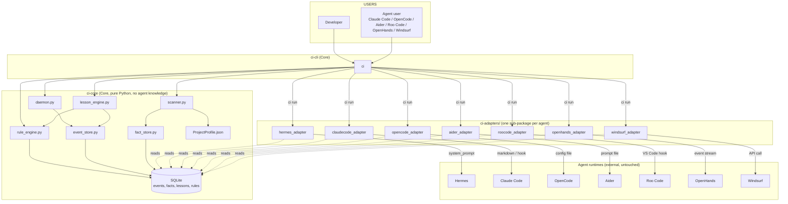

# Product Packaging Review – Continuous Improvement

> **Reviewer:** Malcolm Khong <[REDACTED]>  
> **Date:** 2026‑06‑23 (revised npm‑first: 2026‑06‑23)  
> **Scope:** Critique of `PLAN.md` from a *product‑packaging* perspective,
> now scoped to **npm‑installable CLI** for solo developers, indie hackers,
> and small teams using Claude Code, OpenCode, Aider, or Roo Code.  
> **Goal:** Reframe Continuous Improvement (CI) as an **independent
> open‑source npm package** – not a Hermes feature, not a Docker image,
> not a Helm chart. **Hermes is deferred** to v0.2+.  
> **Audience:** Anyone deciding whether CI is worth shipping as a standalone npm package.

---

## TL;DR

The current plan is a **Hermes feature**, not a product. Almost every component is wired into Hermes’ CLI, file layout, `config.yaml`, `state.db` location, and Python import paths. If we publish CI as‑is on PyPI, **only Hermes users could use it**, and any Hermes refactor would silently break CI.

The fix is straightforward: apply **hexagonal architecture** (ports & adapters). Split the codebase into:

* **`ci-core`** – engine, storage, scanner, lesson/rule logic. Pure Python, zero coupling to any agent.
* **`ci-adapters/`** – one adapter per agent (Hermes, Claude Code, OpenCode, Aider, Roo Code, OpenHands, Windsurf). Each adapter is a thin translation layer.
* **`ci-cli`** – the user‑facing CLI (`ci` / `ci-agent`). Talks to core only.

After the split, CI is installable on its own (`pip install ci`, `uv tool install ci`, `docker run ci …`) and adapters are *optional* extras.

---

## 1. Is the current architecture too tightly coupled to Hermes?

**Yes – critically.** Coupling score per component:

| Component | Coupling to Hermes | Evidence |
|-----------|--------------------|----------|
| `hermes_ci/daemon.py` | **High** | Reads `config.yaml` from `~/.hermes/`; PID file at `~/.hermes/hermes_ci.pid`; log at `~/.hermes/logs/ci_watcher.log`; flag name `auto_load_continuous_improvement` is Hermes‑specific. |
| `hermes_ci/scanner.py` | **Medium** | Calls `repository.locate_root` (Hermes module) and `memory_manager.store_fact` (Hermes module) to persist facts. |
| `hermes_ci/lesson_engine.py` | **Medium** | Reads events from Hermes’ `state.db`; uses Hermes’ `trajectory.tail()`. |
| `hermes_ci/rule_generator.py` | **Medium** | Calls Hermes’ `rule_guardrails.add_rule()`. |
| `hermes_ci/runner.py` | **High** | Imports Hermes’ `system_prompt.build`; CLI is `hermes‑ci` (sub‑command of `hermes`). |
| Persistence (`state.db`) | **High** | Reuses Hermes’ DB file, tables, and migrations. |
| `hermes_agent/cli.py` patch | **High** | Adds a sub‑command to Hermes’ CLI. |
| `hermes_agent/memory_manager.py` patch | **High** | Extends Hermes code. |
| `hermes_agent/system_prompt.py` patch | **High** | Extends Hermes code. |
| `hermes_agent/rule_guardrails.py` patch | **High** | Extends Hermes code. |
| `hermes_agent/context_engine.py` patch | **Medium** | Extends Hermes code. |
| SKILL.md / references | **Low** | Docs – portable. |
| JSON schemas | **Low** | Portable. |

**Verdict:** 5 of 11 components are *Hermes‑invasive* (require editing Hermes’ source). 4 are *Hermes‑coupled* (import Hermes modules at runtime). Only 2 are portable. **The product is not shippable as a standalone library without ripping out the dependencies.**

---

## 2. If Hermes disappeared tomorrow, what would break?

| Survives | Breaks immediately |
|----------|-------------------|
| ✅ JSON schemas | ❌ `daemon.py` – no `config.yaml`, no PID/log paths |
| ✅ SKILL.md (portable) | ❌ `scanner.py` – `repository.locate_root` undefined |
| ✅ The *concepts* (Event, Fact, Lesson, Rule, ProjectProfile) | ❌ `lesson_engine.py` – no `state.db`, no `trajectory.tail` |
| ✅ CLI grammar (if ported) | ❌ `rule_generator.py` – `rule_guardrails.add_rule` undefined |
| ✅ JSON Profile | ❌ `runner.py` – `system_prompt.build` undefined |
| | ❌ All 5 P0/P1 Hermes patches (CLI, memory_manager, system_prompt, rule_guardrails, context_engine) |
| | ❌ Whole daemon fails to start (config flag not found) |
| | ❌ `pytest` fixtures – reference `state.db` schema |
| | ❌ Helm chart – copies Hermes config |
| | ❌ The whole `helm/ci-daemon` chart (paths hard‑coded) |

**Bottom line: a Hermes‑less CI install is a brick.** That’s the *one* thing we cannot ship.

---

## 3. Core vs Adapter – where does each component belong?

| Component | Belongs in | Why |
|-----------|------------|-----|
| **Event log** (append‑only SQLite table) | **Core** | Pure storage; no agent knowledge. |
| **Fact store** (project knowledge) | **Core** | Agent‑independent knowledge. |
| **Lesson engine** (events → lessons) | **Core** | Statistical / heuristic logic; no agent knowledge. |
| **Rule engine** (storage + enforcement) | **Core** | A *rule* is `condition → action`; both sides are JSON, not agent‑specific. |
| **Project scanner** (folder walk, ADR parse, dep parse) | **Core** | Operates on a *repo*, not an agent. |
| **Daemon** (background process, scheduler) | **Core** | The *runtime* that drives Core. |
| **CLI** (`ci daemon start`, `ci scan`, `ci lessons run`, `ci rules list`, `ci events list`, `ci facts show`) | **Core** | Generic ops; same commands for every user. |
| **ProjectProfile dataclass + JSON schema** | **Core** | The data contract. |
| **Prompt enrichment** (Facts + Rules → injected into system prompt) | **Adapter** | The *way* facts/rules are pushed into the agent differs per agent (Hermes: `system_prompt.build`; Claude Code: a markdown block; OpenCode: a config file; etc.). |
| **Pre‑run hook** (`ci run <agent> foo.py`) | **Adapter** | Needs to know how to launch the specific agent binary. |
| **Event source** (turn‑by‑turn agent events) | **Adapter** | Each agent surfaces events differently (Hermes trajectory, Claude Code JSONL logs, etc.). |
| **Rule transport** (how a rule reaches the agent) | **Adapter** | Hermes: `rule_guardrails`; Claude Code: hook script; etc. |
| **Config file location** | **Adapter** | Hermes: `~/.hermes/config.yaml`; others: their own. |
| **PID / log paths** | **Core (defaults) + Adapter (overrides)** | Core picks reasonable defaults; adapter can override. |
| **Helm chart** | **Core** (Docker image) + **Adapter** (per‑agent values.yaml) | The container runs Core; per‑agent values inject the right adapter. |

**One‑line summary:** *Engine and storage move to Core; everything that touches an agent binary, config, or hook moves to an Adapter.*

---

## 4. Redesigned Architecture (hexagonal)



### 4.1 Core interfaces (ports)

Every adapter implements these three ports. Core never imports an adapter.

```python
# ci_core/ports/agent.py
from typing import Protocol, Iterable
from ci_core.models import Event, ProjectProfile, Rule

class AgentAdapter(Protocol):
    """A port that any agent integration must satisfy."""

    name: str                               # e.g. "hermes", "claude-code"

    def load_profile(self) -> ProjectProfile: ...
    def load_active_rules(self) -> list[Rule]: ...
    def emit_event(self, event: Event) -> None: ...
    def enrich_prompt(self, base: str, profile: ProjectProfile, rules: list[Rule]) -> str: ...
    def run(self, prompt: str, *args, **kwargs) -> int: ...
```

```python
# ci_core/ports/storage.py
class EventStore(Protocol):
    def append(self, event: Event) -> None: ...
    def tail(self, since_ms: int) -> Iterable[Event]: ...

class FactStore(Protocol):
    def put(self, key: str, value: dict) -> None: ...
    def get(self, key: str) -> dict | None: ...

class RuleStore(Protocol):
    def add(self, rule: Rule) -> None: ...
    def remove(self, rule_id: str) -> None: ...
    def list_active(self) -> list[Rule]: ...
```

`SQLiteEventStore`, `SQLiteFactStore`, `SQLiteRuleStore` are the default
implementations. JSON‑file implementations are also shipped for tiny setups.

### 4.2 Adapter shape (one per agent)

```
ci_adapters/hermes/
├── __init__.py
├── adapter.py          # implements AgentAdapter
├── event_source.py     # tails Hermes trajectory → Event stream
├── config.py           # reads ~/.hermes/config.yaml
└── tests/
```

* `adapter.py` – thin wrapper around `system_prompt.build` + Hermes CLI.
* `event_source.py` – imports *only* `ci_core` and `hermes_agent` if present.
  If `hermes_agent` is not installed, the adapter fails *gracefully* with a
  clear error: `pip install ci-adapter-hermes` to enable.
* `config.py` – reads Hermes config; if absent, falls back to CI’s own
  defaults.

> **Critical rule:** adapters may import Core; Core may **never** import an
> adapter. Enforced by CI lint (see §7).

---

## 5. Proposed GitHub Repository Structure

> Single repository, **monorepo** layout, multiple **distributable packages**.

```
ci/                                    # GitHub: continuous-improvement/ci
├── README.md
├── LICENSE                              # Apache‑2.0 (recommended)
├── CONTRIBUTING.md
├── CODE_OF_CONDUCT.md
├── SECURITY.md
├── pyproject.toml                       # workspace + tool config
├── uv.lock                              # uv workspace lock
├── .github/
│   ├── workflows/
│   │   ├── ci.yml                       # lint + test matrix (3.10, 3.11, 3.12)
│   │   ├── release.yml                  # build & publish on tag v*
│   │   ├── docker.yml                   # build & push ghcr.io/continuous-improvement/ci
│   │   └── codeql.yml
│   ├── ISSUE_TEMPLATE/
│   └── PULL_REQUEST_TEMPLATE.md
├── docker/
│   ├── Dockerfile                       # python:3.11‑slim, runs `ci daemon`
│   ├── docker-compose.yml               # ci + volume + optional adapter sidecar
│   └── entrypoint.sh
├── helm/
│   └── ci/
│       ├── Chart.yaml
│       ├── values.yaml
│       └── templates/
│           ├── deployment.yaml
│           ├── service.yaml
│           ├── configmap.yaml
│           └── adapters/                # values‑driven adapter injection
│               ├── hermes.yaml
│               ├── claudecode.yaml
│               └── …
├── packages/
│   ├── ci_core/                         # Core package
│   │   ├── pyproject.toml               # name = "ci-core", pip + uv tool
│   │   ├── src/ci_core/
│   │   │   ├── __init__.py
│   │   │   ├── daemon.py
│   │   │   ├── scanner.py
│   │   │   ├── lesson_engine.py
│   │   │   ├── rule_engine.py
│   │   │   ├── event_store.py
│   │   │   ├── fact_store.py
│   │   │   ├── models.py                # Event, Fact, Lesson, Rule, ProjectProfile
│   │   │   ├── schemas/                 # JSON Schemas
│   │   │   └── ports/                   # Protocol definitions
│   │   └── tests/
│   ├── ci_cli/                          # CLI package
│   │   ├── pyproject.toml               # name = "ci", entry_points = ["ci"]
│   │   ├── src/ci_cli/
│   │   │   ├── __init__.py
│   │   │   ├── main.py                  # click / typer app
│   │   │   └── commands/
│   │   │       ├── daemon.py
│   │   │       ├── scan.py
│   │   │       ├── lessons.py
│   │   │       ├── rules.py
│   │   │       ├── events.py
│   │   │       └── run.py
│   │   └── tests/
│   └── ci_adapters/                     # one sub‑package per agent
│       ├── hermes/
│       │   ├── pyproject.toml           # name = "ci-adapter-hermes"
│       │   ├── src/ci_adapters/hermes/
│       │   └── tests/
│       ├── claudecode/
│       ├── opencode/
│       ├── aider/
│       ├── roocode/
│       ├── openhands/
│       └── windsurf/
├── docs/
│   ├── index.md                         # landing page
│   ├── quickstart.md
│   ├── adapters/
│   │   ├── hermes.md
│   │   ├── claudecode.md
│   │   ├── opencode.md
│   │   └── …
│   ├── architecture.md
│   ├── contributing/
│   │   ├── add-an-adapter.md            # adapter author guide
│   │   └── coding-style.md
│   └── CHANGELOG.md
├── scripts/
│   ├── smoke.sh
│   ├── publish.sh
│   └── verify_no_circular_imports.py    # enforces Core ← Adapter rule
└── tests/
    └── integration/                     # cross‑package tests
```

### 5.1 Distribution channels

| Channel | Package | Command |
|---------|---------|---------|
| **PyPI** | `ci-core`, `ci`, `ci-adapter-hermes`, `ci-adapter-claudecode`, … | `pip install ci` / `pip install ci-adapter-hermes` |
| **uv tool** | same as above | `uv tool install ci` / `uv tool install ci-adapter-claudecode` |
| **Docker** | ghcr.io/continuous-improvement/ci | `docker run -v ~/.ci:/data ghcr.io/continuous-improvement/ci daemon` |
| **GitHub Releases** | wheel + sdist tarballs | `gh release download v0.1.0` |
| **Helm** | `oci://ghcr.io/continuous-improvement/charts/ci` | `helm install ci oci://ghcr.io/continuous-improvement/charts/ci --version 0.1.0` |

### 5.2 Versioning

* `ci-core` follows **SemVer** strictly. Bump minor for new ports; major for
  breaking port changes.
* Adapters follow their own SemVer and pin a `ci-core` range.
* Docker image tag = `ci-core` version + adapter digest (multi‑arch).

---

## 6. Files to move out of Hermes

| Current file (in Hermes) | New home (CI repo) | Reason |
|--------------------------|--------------------|--------|
| `hermes_ci/daemon.py` | `packages/ci_core/src/ci_core/daemon.py` | Core runtime. |
| `hermes_ci/scanner.py` | `packages/ci_core/src/ci_core/scanner.py` | Core scanner. |
| `hermes_ci/lesson_engine.py` | `packages/ci_core/src/ci_core/lesson_engine.py` | Core engine. |
| `hermes_ci/rule_generator.py` | `packages/ci_core/src/ci_core/rule_engine.py` | Core engine. |
| `hermes_ci/runner.py` | `packages/ci_adapters/hermes/src/ci_adapters/hermes/adapter.py` | **Adapter‑level** – it injects Hermes’ system prompt. |
| `hermes_ci/schemas/*.json` | `packages/ci_core/src/ci_core/schemas/*.json` | Data contract. |
| `hermes_ci/tests/*` | `packages/ci_core/tests/` | Tests follow code. |
| Hermes patch in `cli.py` | `packages/ci_cli/src/ci_cli/main.py` | The CI CLI is *its own* binary now, not a Hermes sub‑command. |
| Hermes patch in `memory_manager.py` | **remove** – CI owns its own event store | CI must not pollute Hermes. |
| Hermes patch in `system_prompt.py` | `packages/ci_adapters/hermes/src/ci_adapters/hermes/prompt_bridge.py` | Adapter‑specific. |
| Hermes patch in `rule_guardrails.py` | `packages/ci_adapters/hermes/src/ci_adapters/hermes/rule_bridge.py` | Adapter‑specific. |
| Hermes patch in `context_engine.py` | `packages/ci_adapters/hermes/src/ci_adapters/hermes/profile_bridge.py` | Adapter‑specific. |
| `helm/ci-daemon/` | `helm/ci/` | Renamed; values‑driven. |
| `skills/continuous-improvement/SKILL.md` | `docs/` (in CI repo) | The skill *describes* CI; ship it with the product. |
| `skills/continuous-improvement/PLAN.md` | `docs/PRODUCT_PACKAGING_REVIEW.md` (this file) + `docs/ROADMAP.md` | Documentation lives in the product repo. |
| `skills/continuous-improvement/references/*` | `docs/architecture/` | Same. |

**Net effect on Hermes:** all five patches revert. Hermes stays exactly as
it is; the CI subtree leaves the building.

---

## 7. Roadmap (re‑prioritised: Core → Adapters → Hermes)

> Old order (Hermes‑first) is replaced with a **product‑first** order. The
> Hermes adapter is just *one* milestone, not the foundation.

| Milestone | Goal | Deliverable | Effort | Acceptance |
|-----------|------|-------------|--------|------------|
| **M0 – Repo skeleton** | Stand up the monorepo, CI workflows, Docker base, Helm skeleton, license, contributing guide. | `ci/ci` repo on GitHub; CI green on `pytest` placeholder; Docker image builds; Helm chart lints. | 2 days | • `pip install -e packages/ci_core` works. <br>• `docker build .` succeeds. <br>• `helm lint helm/ci` passes. |
| **M1 – Core Engine** | Implement `ci_core`: models, ports, event/fact/rule stores, scanner, lesson engine, rule engine, daemon. CLI lives in `ci_cli`. | `ci-core` 0.1.0 on PyPI; `ci` CLI binary; SQLite‑only; 90 % test coverage; integration test in `tests/integration`. | 1 week | • `ci scan` writes `~/.ci/project_profile.json`. <br>• `ci daemon start` keeps process alive. <br>• `ci lessons run` generates ≥ 1 lesson from injected events. <br>• `ci rules list` shows generated rules. |
| **M2 – Adapter Layer (ports & framework)** | Define the `AgentAdapter` Protocol in `ci_core/ports`; ship a stub adapter and an **adapter author guide** in `docs/contributing/add-an-adapter.md`. | `docs/contributing/add-an-adapter.md` published; `ci-adapter-stub` example package; CI lint that **fails** if `ci_core` ever imports an adapter. | 3 days | • New contributor can scaffold an adapter in < 1 h using the template. <br>• `verify_no_circular_imports.py` script is part of the CI matrix. |
| **M3 – Hermes Adapter (adapter #1)** | Implement the Hermes adapter: bridge to `system_prompt`, `trajectory`, `rule_guardrails`; event source that tails Hermes trajectory; config reader for `~/.hermes/config.yaml`. | `ci-adapter-hermes` 0.1.0 on PyPI; `helm/ci/values-adapter-hermes.yaml` example; end‑to‑end test that runs a real Hermes turn and verifies a new rule appears. | 3 days | • `pip install ci ci-adapter-hermes` works on a fresh machine. <br>• `ci run hermes foo.py` produces enriched prompt + emits events. <br>• `ci-adapter-hermes` has its own README and changelog. |
| **M4 – Claude Code Adapter** | Adapter #2. | `ci-adapter-claudecode` 0.1.0. | 2 days | • `ci run claudecode file.py` injects facts + rules via Claude Code’s `--append-system-prompt` (or equivalent). |
| **M5 – OpenCode, Aider, Roo Code, OpenHands, Windsurf Adapters** | Adapters #3‑#7. Each one is a thin translation layer. | Five PyPI packages, each ≤ 500 LOC. | 2 days each (≈ 2 weeks total, can parallelise) | • `ci run opencode …` / `aider …` / etc. all work. |
| **M6 – Polish & Release 0.1.0** | Docs site, GitHub release, Docker multi‑arch, Helm chart publication to GHCR, release notes. | `v0.1.0` tag; blog post; Twitter/Bluesky announcement. | 2 days | • `pip install ci` works. <br>• `docker pull ghcr.io/continuous-improvement/ci:0.1.0` works. <br>• `helm install ci oci://…/ci --version 0.1.0` works. |
| **M7 – Multi‑repo scanner, web dashboard, distributed KB, LLM‑summarised lessons** | Deferred from V1; revisit post‑launch. | – | – | – |

**Total time to first public release:** ~ 3 weeks (M0‑M3 + a subset of M4‑M5 for the launch). The first *non‑Hermes* adapter arrives in week 2, which proves the design is truly reusable.

### 7.1 Why the order matters

* **Core first** forces us to discover the right *ports* (interfaces) before
  any agent biases leak in.
* **Adapter framework second** makes adding new adapters cheap (the
  *attractiveness* of an OSS project is its plugin‑ease).
* **Hermes third** is now a *consumer* of Core, not its *owner*. Hermes’
  team can adopt CI without us blocking on their release schedule.
* **Other adapters** can land in parallel because they don’t touch Core.

---

## 8. Risks specific to the product split

| Risk | Likelihood | Impact | Mitigation |
|------|------------|--------|------------|
| **Adapter drift** – agents change their CLI/JSON format, breaking adapters | High | Medium | Adapter contract tests (one per adapter); CI runs them on every Core release. |
| **Dependency bloat** – users install `ci` and pull in all adapters | Medium | Medium | Adapters are **separate PyPI packages**; users opt in (`pip install ci-adapter-hermes`). |
| **Hermes‑specific concepts leak back into Core** (e.g. `auto_load_continuous_improvement` flag) | High | High | Add `verify_no_circular_imports.py` to CI; **lint rule**: no `hermes_` strings in `ci_core/`. |
| **Packaging complexity** (monorepo, multiple wheels) confuses new contributors | Medium | Medium | Document `uv workspace` workflow in `CONTRIBUTING.md`; keep Core the only package required for hacking. |
| **SQLite‑only design hits scaling wall** | Low | Low | `EventStore`, `FactStore`, `RuleStore` are Protocols – swap to Postgres later without touching Core logic. |
| **License incompatibility** (some adapters may want GPL‑friendly code) | Low | Medium | Default to Apache‑2.0; document per‑adapter license exceptions in `docs/adapters/<name>.md`. |

---

## 9. Concrete next steps (week‑by‑week)

### Week 1 – Core
1. `git init ci && gh repo create continuous-improvement/ci --public`
2. `uv init` workspace; add `packages/ci_core`, `packages/ci_cli`.
3. Implement `models.py`, `event_store.py`, `fact_store.py`, `rule_store.py`.
4. Implement `scanner.py`, `lesson_engine.py`, `rule_engine.py`, `daemon.py`.
5. Wire `ci_cli/main.py` (use **Typer** – one file per command).
6. Ship `ci-core` 0.1.0‑alpha to TestPyPI.

### Week 2 – Adapter framework + Hermes
7. Add `ci_core/ports/agent.py` Protocol.
8. Publish `docs/contributing/add-an-adapter.md`.
9. Create `packages/ci_adapters/hermes/`; implement the four bridges.
10. End‑to‑end test against a real Hermes install.
11. Ship `ci-adapter-hermes` 0.1.0‑alpha to TestPyPI.

### Week 3 – Other adapters + launch
12. Land `ci-adapter-claudecode` (priority #1 – the biggest audience).
13. Land `ci-adapter-opencode`, `ci-adapter-aider` (one PR each).
14. Tag **v0.1.0**; release to PyPI + GHCR + Helm OCI.
15. Write the launch blog post; submit to Hacker News, r/LocalLLama, etc.

---

## 10. Updated Definition of Done – Product 0.1.0

* [ ] `pip install ci` succeeds on a clean Ubuntu VM.
* [ ] `uv tool install ci` succeeds.
* [ ] `docker run ghcr.io/continuous-improvement/ci:0.1.0 daemon` runs the
      daemon for ≥ 24 h.
* [ ] `helm install ci oci://ghcr.io/continuous-improvement/charts/ci --version 0.1.0`
      deploys a working pod.
* [ ] At least **one non‑Hermes** adapter (`ci-adapter-claudecode`) is
      published and works end‑to‑end.
* [ ] `tests/integration` matrix covers: Core, Hermes adapter, Claude Code
      adapter, Docker, Helm.
* [ ] `LICENSE`, `CODE_OF_CONDUCT.md`, `CONTRIBUTING.md`, `SECURITY.md` are
      present.
* [ ] `docs/quickstart.md` walks a new user from `pip install` to first rule
      in < 10 minutes.
* [ ] GitHub Release v0.1.0 is published with wheel + sdist + SBOM.

---

## 11. One‑sentence summary

> *Continuous Improvement is not a Hermes feature – it is a tiny, opinionated
> knowledge engine that any coding agent can plug into via a 200‑line
> adapter; ship it as a standalone product, and treat Hermes as Adapter #1,
> not the host.*

---

*End of review. Companion changes: `PLAN.md` §2 (architecture) and §7 (roadmap)
must be replaced by the contents of §§4 and 7 above.*
